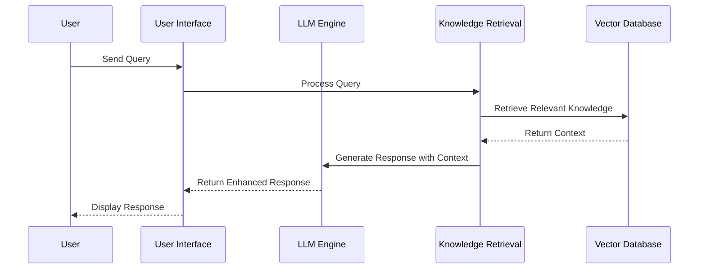

# LLM-Based Chatbot Framework Architecture

## Overview

This guide outlines the architecture of our LLM-Based Chatbot Development Framework, a comprehensive system for building domain-specific conversational agents with knowledge retrieval capabilities. The framework is designed to be modular, extensible, and adaptable to various use cases.

The Utah Teacher Training Assistant (UTTA) is featured as a case study implementation of this framework, demonstrating how it can be applied to create educational applications.

### Core Framework Architecture

## Components

### 1. User Interface (Streamlit)
- Interactive training scenarios
- Real-time feedback display
- Progress tracking
- Session management

### 2. LLM Integration
- OpenAI API for scenario generation
- DSPy for response optimization
- Context-aware interactions

### 3. Knowledge Base
- ChromaDB for vector storage
- Educational content management
- Teaching strategy retrieval

## Data Flow

1. **Training Session**
   - Teacher initiates session
   - System loads relevant materials
   - LLM generates teaching scenario
   - Teacher receives interactive content

2. **Response Handling**
   - Teacher submits response
   - System evaluates using LLM
   - Feedback generated and displayed
   - Progress tracked and stored

## Technical Stack

- **Frontend**: Streamlit
- **LLM**: OpenAI + DSPy
- **Database**: ChromaDB
- **Storage**: Local filesystem
- **Caching**: Streamlit cache

## Security

- Environment-based API key management
- Secure session handling
- Input validation
- Rate limiting

## Performance

- Streamlit caching
- Optimized API calls
- Efficient resource management
- Error logging and monitoring 