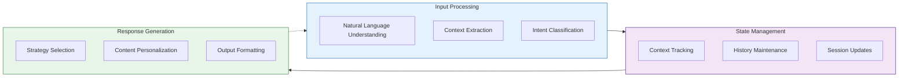
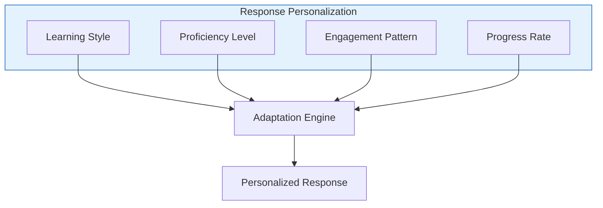
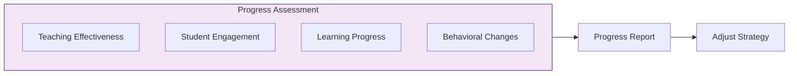

# Building LLM-Based Chatbots with Knowledge Retrieval

[]() 
[]()

## Learning Objectives

By the end of this guide, you'll be able to:
- Design sophisticated chatbot architectures with knowledge retrieval capabilities
- Implement conversation management systems for tracking context and user interactions
- Create personalization strategies that adapt to specific domain requirements
- Build comprehensive knowledge integration and retrieval mechanisms
- Deploy and evaluate LLM-based chatbots in real-world scenarios

## LLM-Based Chatbot Architecture

### Core Components

The framework architecture consists of these essential components:

1. **Document Processing Pipeline**: Processes various document formats to extract domain knowledge
2. **Vector Knowledge Base**: Stores and retrieves information using semantic search
3. **LLM Integration Layer**: Connects with various LLM providers (OpenAI, Anthropic, etc.)
4. **Conversation Manager**: Maintains context and manages the flow of interactions
5. **Response Generator**: Creates coherent and contextually relevant responses

### Case Study: UTTA

The Utah Teacher Training Assistant (UTTA) implements this architecture for educational purposes:



### Conversation Lifecycle

Educational chatbots operate through a structured lifecycle:

1. **Initialization**
   - Load user profiles and learning preferences
   - Initialize conversation state and learning objectives
   - Set up tracking metrics and evaluation criteria

2. **Active Interaction**
   - Process user inputs and extract learning needs
   - Generate appropriate educational responses
   - Track engagement levels and learning progress

3. **Progress Monitoring**
   - Evaluate teaching effectiveness continuously
   - Adjust difficulty levels based on performance
   - Provide real-time feedback on learning progress

4. **Session Completion**
   - Generate comprehensive session summaries
   - Save progress data for longitudinal analysis
   - Provide improvement suggestions and learning paths

## Conversation Management

Effective educational chatbots require sophisticated conversation management.

### Context Tracking

```python
class ConversationContext:
    def __init__(self):
        self.history = []
        self.current_topic = None
        self.student_state = StudentState()
        self.teaching_goals = TeachingGoals()

    def update(self, message: Message):
        """Update conversation context with new message."""
        self.history.append(message)
        self._update_topic(message)
        self._update_student_state(message)
        self._check_teaching_goals(message)

    def get_relevant_context(self, window_size: int = 5):
        """Get recent context for response generation."""
        return {
            'history': self.history[-window_size:],
            'topic': self.current_topic,
            'student_state': self.student_state.current,
            'goals': self.teaching_goals.pending
        }
```

### Memory Management

Educational chatbots need multiple memory systems:

| Memory Type | Purpose | Implementation |
|-------------|---------|----------------|
| Short-term | Current conversation | In-memory queue with size limit |
| Working | Active learning tasks | Priority queue with decay function |
| Long-term | User profile & history | Persistent storage with semantic indexing |
| Episodic | Past learning scenarios | Vector database with retrieval mechanisms |

### Dialog Management

```python
class DialogManager:
    def __init__(self, llm_client, knowledge_base):
        self.context = ConversationContext()
        self.history = []
        self.llm = llm_client
        self.knowledge_base = knowledge_base
        
    def process_input(self, user_input):
        """Process user input and generate response."""
        # Update context with user input
        user_message = Message(content=user_input, sender="user")
        self.context.update(user_message)
        
        # Generate response using context and knowledge
        response = self._generate_response(user_input)
        
        # Update context with system response
        system_message = Message(content=response, sender="system")
        self.context.update(system_message)
        
        # Update history
        self._update_history(user_input, response)
        
        return response
```

## Educational Features

### Personalization

Adapt responses to individual learner needs:



### Progress Assessment

Continuously evaluate learning progress:



### Adaptive Feedback

Provide targeted feedback based on learning needs:

```python
class FeedbackSystem:
    def generate_feedback(self, interaction, progress_assessment):
        """Generate comprehensive feedback."""
        return {
            'immediate': self._immediate_feedback(interaction),
            'analytical': self._analytical_feedback(interaction, progress_assessment),
            'constructive': self._constructive_feedback(interaction, progress_assessment),
            'summative': self._summative_feedback(progress_assessment)
        }
```

## Implementation Approach

### Core Chatbot Implementation

```python
class EducationalChatbot:
    def __init__(self, config):
        # Initialize components
        self.llm = self._initialize_llm(config['llm'])
        self.knowledge_base = self._initialize_knowledge_base(config['knowledge'])
        self.dialog_manager = DialogManager(self.llm, self.knowledge_base)
        self.personalization = PersonalizationEngine(config['user_profile'])
        self.assessment = ProgressAssessment(config['learning_objectives'])
        self.feedback = FeedbackSystem()
```

### Best Practices

For effective educational chatbots, follow these implementation guidelines:

1. **Teaching Persona**
   - Maintain a consistent, supportive personality
   - Use age-appropriate language and explanations
   - Show empathy and patience with struggling learners
   - Adjust tone for different educational contexts

2. **Error Handling**
   - Implement graceful fallback responses
   - Provide clear guidance when user inputs are unclear
   - Use knowledge gaps as teaching opportunities
   - Recognize and recover from conversation breakdowns

3. **Quality Monitoring**
   - Track key conversation and learning metrics
   - Monitor engagement levels across sessions
   - Analyze teaching effectiveness systematically
   - Identify patterns requiring intervention

4. **Learning Objective Alignment**
   - Maintain clear connections to curriculum objectives
   - Track progress against specific learning goals
   - Provide appropriate recognition for achievements
   - Adjust difficulty based on mastery level

5. **Assessment Integration**
   - Incorporate regular formative assessments
   - Balance assessment with engagement
   - Provide detailed performance analytics
   - Use assessment data to personalize learning

## Hands-On Exercise: Building a Simple Educational Chatbot

Let's implement a basic educational chatbot for teaching programming concepts:

```python
import argparse
import json
import os
import time
from datetime import datetime
import openai

class ProgrammingTutor:
    def __init__(self, openai_api_key=None):
        """Initialize the programming tutor chatbot."""
        # Set up OpenAI client
        if openai_api_key:
            openai.api_key = openai_api_key
        else:
            openai.api_key = os.getenv("OPENAI_API_KEY")
            
        # Initialize conversation state
        self.conversation_history = []
        self.student_profile = {
            "proficiency": "beginner",
            "learning_style": "visual",
            "topics_covered": [],
            "strengths": [],
            "areas_for_improvement": []
        }
```

## Key Takeaways

- Educational chatbots require specialized architectures focused on learning outcomes
- Effective conversation management is essential for maintaining educational context
- Personalization adapts content to individual learning styles and proficiency levels
- Progress assessment provides insights for both learners and educators
- Well-designed feedback systems are critical for effective learning

## Project: Educational Assistant

Build an educational assistant for a subject of your choice:

1. Design the chatbot architecture and learning objectives
2. Implement a conversation management system with history tracking
3. Create a knowledge base of educational content in your chosen domain
4. Develop a personalization system that adapts to different learners
5. Implement assessment and feedback mechanisms
6. Test your chatbot with sample learning scenarios
7. Evaluate effectiveness and refine your implementation

## References

- Winkler, R., & Söllner, M. (2018). *Unleashing the Potential of Chatbots in Education*
- Smutny, P., & Schreiberova, P. (2020). *Chatbots for Learning: A Review of Educational Chatbots*
- Goel, A., & Polepeddi, L. (2017). *Jill Watson: A Virtual Teaching Assistant for Online Education*

## Further Reading

- [Vector Store Implementation](Vector-Store-Implementation)
- [Knowledge Applications](Knowledge-Applications)
- [LLM Integration Techniques](Knowledge-LLM-Integration)
- [Evaluation and Testing](Evaluation-Testing) 