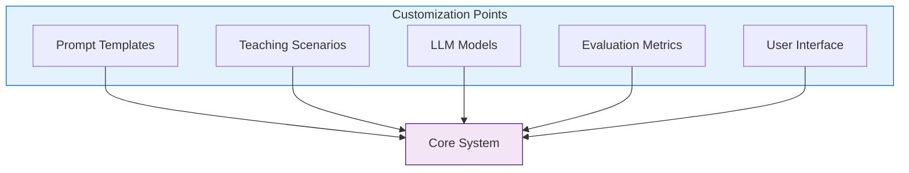

# Implementation Guide

## 🚀 Setting Up the Environment

### Installation Steps

#### 1. Clone the Repository
```bash
# Clone the repository
git clone https://github.com/UVU-AI-Innovate/UTTA.git
cd UTTA
```

#### 2. Install Dependencies
```bash
# Install required packages
pip install -r requirements.txt
```

### Project Structure
The main application files are organized in the root directory:

```
UTTA/
├── web_app.py           # Streamlit web interface
├── ai_agent.py          # Core AI agent implementation
├── llm_handler.py       # Language model processing
├── llm_interface.py     # LLM communication interface
├── knowledge_base.py    # Teaching strategies and characteristics
├── evaluator.py         # Response evaluation module
├── prompt_templates.py  # LLM prompt templates
├── tests/              # Test suite
├── docs/               # Documentation
├── resources/          # Additional resources
└── requirements.txt    # Project dependencies
```

### Running the Application

To start the web interface:
```bash
streamlit run web_app.py
```

The application will be available at:
- Local URL: http://localhost:8501
- Network URL: Displayed in terminal

### Key Components

1. **Web Interface (`web_app.py`)**
   - Streamlit-based user interface
   - Handles user interactions and display

2. **AI Agent (`ai_agent.py`)**
   - Core simulation logic
   - Manages teaching scenarios and evaluations

3. **LLM Handler (`llm_handler.py`)**
   - Processes natural language
   - Manages LLM interactions

4. **Knowledge Base (`knowledge_base.py`)**
   - Teaching strategies
   - Student characteristics
   - Behavioral scenarios

5. **Evaluator (`evaluator.py`)**
   - Response evaluation logic
   - Feedback generation

6. **LLM Interface (`llm_interface.py`)**
   - LLM communication layer
   - Response generation

7. **Prompt Templates (`prompt_templates.py`)**
   - LLM prompt management
   - Scenario templates

## 🔄 Application Flow

### 1. Initialization Phase
System startup involves:
- Loading configuration settings from config.yaml
- Initializing the LLM interface and ensuring model availability
- Loading the knowledge base with teaching strategies and resources
- Setting up the teacher profile and simulation parameters

### 2. Teacher Profile Setup
Profile configuration includes:
- Collecting teacher information (experience level, grade preferences)
- Setting preferred subjects and teaching style
- Identifying areas for professional development
- Storing profile for personalized scenarios

### 3. Training Session Flow

```mermaid
graph LR
    subgraph Scenario[1. Scenario Generation]
        Subject[Select subject]
        Difficulty[Set difficulty]
        Profile[Generate profile]
    end

    subgraph Interaction[2. Teacher Interaction]
        Present[Present scenario]
        Accept[Accept response]
        Process[Process strategy]
    end

    subgraph Analysis[3. Response Analysis]
        Evaluate[Evaluate effectiveness]
        Generate[Generate feedback]
        Suggest[Suggest improvements]
    end

    Scenario --> Interaction
    Interaction --> Analysis

    style Scenario fill:#e3f2fd,stroke:#1565c0
    style Interaction fill:#f3e5f5,stroke:#4a148c
    style Analysis fill:#e8f5e9,stroke:#2e7d32
```


### 4. Feedback Generation
Analysis components include:
- **Effectiveness Score:** Numerical evaluation (0-1) of teaching approach
- **Strengths:** Identification of effective strategies used
- **Areas for Improvement:** Specific suggestions for enhancement
- **Alternative Approaches:** Other teaching strategies to consider

### 5. Progress Tracking
Session monitoring includes:
- Track response patterns and improvement
- Monitor strategy effectiveness
- Record successful approaches
- Generate progress reports

## 🔧 Core Component Implementation

### Teacher Training Agent
```python
# src/core/ai_agent.py
class TeacherTrainingAgent:
    """
    Main agent class for managing teacher training simulations.
    
    This class orchestrates the interaction between different components:
    - LLM Interface for AI model interactions
    - Knowledge Manager for accessing teaching strategies
    - Language Processor for analyzing responses
    """
    
    def __init__(self):
        self.llm = LLMInterface()
        self.knowledge = PedagogicalKnowledgeManager()
        self.processor = PedagogicalLanguageProcessor()
        
    def create_teaching_scenario(
        self, 
        subject: str, 
        difficulty: str, 
        student_profile: Dict[str, Any]
    ) -> Dict[str, Any]:
        """Generate a teaching scenario based on parameters."""
        context = {
            "subject": subject,
            "difficulty": difficulty,
            "student_profile": student_profile
        }
        return self.processor.create_scenario(context)
        
    def evaluate_teaching_response(
        self, 
        teacher_input: str, 
        scenario: Dict[str, Any]
    ) -> Dict[str, Any]:
        """Evaluate response and generate feedback."""
        analysis = self.processor.analyze_teaching_response(
            teacher_input=teacher_input,
            context=scenario
        )
        return self.generate_feedback(analysis)
```

### Knowledge Manager
```python
# src/models/knowledge_manager.py
class PedagogicalKnowledgeManager:
    """
    Manages educational knowledge and teaching strategies.
    
    This class provides a comprehensive interface for:
    - Storing and retrieving teaching strategies
    - Managing student behavior patterns
    - Tracking strategy effectiveness
    - Updating knowledge base with new information
    """
    
    def __init__(self):
        self.db = Database()
        self.vector_store = VectorStore()
        
    def get_teaching_strategies(self, context):
        """Retrieve relevant teaching strategies."""
        query = self.build_query(context)
        return self.vector_store.similarity_search(query)
        
    def update_knowledge(self, new_data):
        """Add new teaching strategies."""
        vectors = self.vector_store.encode(new_data)
        self.vector_store.add(vectors)
```

### Language Processor
```python
# src/core/llm_handler.py
class PedagogicalLanguageProcessor:
    """
    Processes natural language in educational contexts using LLMs.
    
    This class handles all language-related tasks in the teaching simulation:
    - Analyzing teacher responses for effectiveness
    - Generating appropriate student reactions
    - Creating realistic teaching scenarios
    - Providing pedagogically sound feedback
    """
    
    def __init__(self):
        self.llm = LLMInterface()
        self.templates = PromptTemplates()
        
    def analyze_teaching_response(self, teacher_input, context):
        """Analyze teaching effectiveness."""
        prompt = self.templates.get("analysis")
        return self.llm.generate(
            prompt=prompt,
            context=context,
            input=teacher_input
        )
        
    def generate_student_reaction(self, context, effectiveness):
        """Generate realistic student responses."""
        prompt = self.templates.get("student_reaction")
        return self.llm.generate(
            prompt=prompt,
            context=context,
            effectiveness=effectiveness
        )
```

## ⚙️ Configuration

### Sample Configuration
```yaml
# config.yaml
llm:
  model: mistral-7b
  temperature: 0.7
  max_tokens: 2048
  context_window: 8192

knowledge_base:
  vector_store: faiss
  embedding_model: instructor-xl
  cache_size: 1000

processor:
  analysis_threshold: 0.8
  feedback_detail_level: detailed
  student_simulation_mode: realistic
```

## 🔧 Customization Options

### Extension Points


### Custom Components
1. **Prompt Templates**
   - Teaching scenario templates
   - Feedback generation templates
   - Student response templates

2. **Teaching Scenarios**
   - Subject-specific scenarios
   - Grade-level adaptations
   - Special education scenarios

3. **Model Integration**
   - Alternative LLM models
   - Custom embeddings
   - Specialized tokenizers

4. **Evaluation Metrics**
   - Custom scoring systems
   - Domain-specific metrics
   - Progress tracking methods

5. **Interface Customization**
   - Custom UI themes
   - Alternative interfaces
   - API extensions 