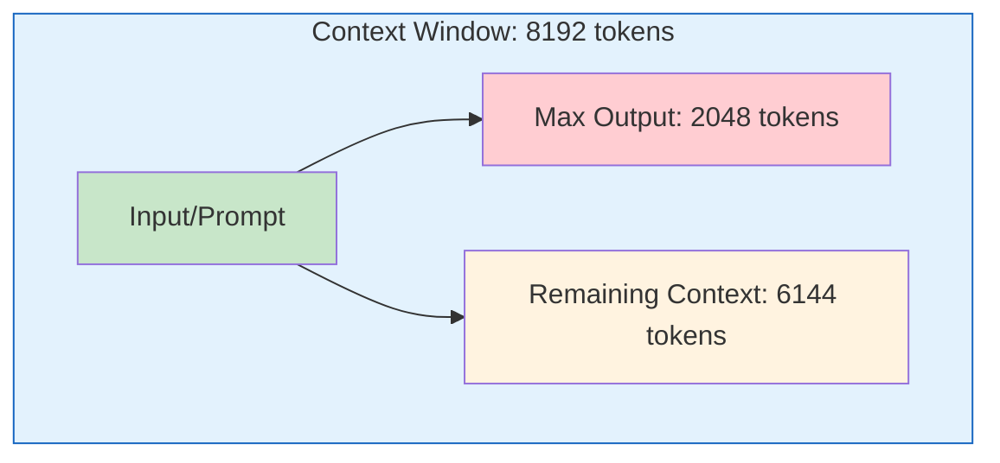
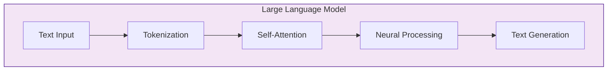
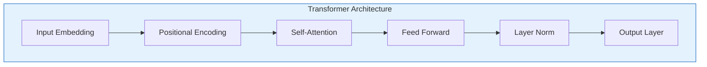
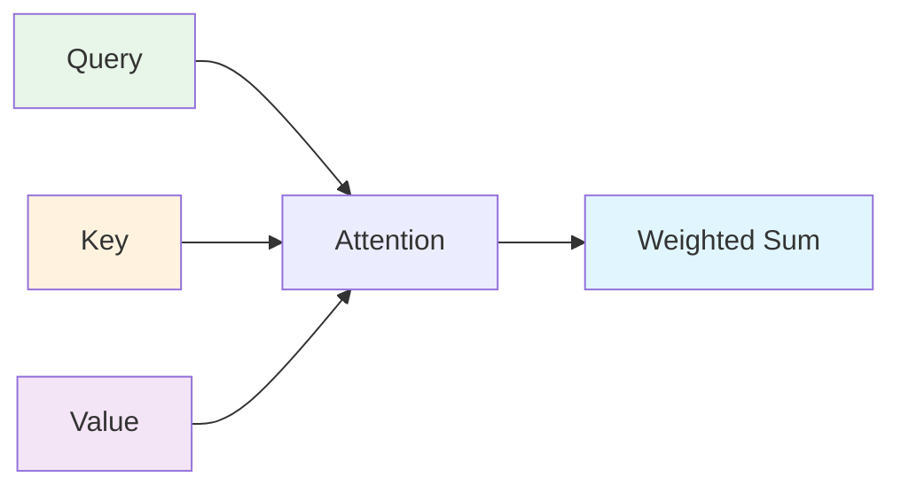
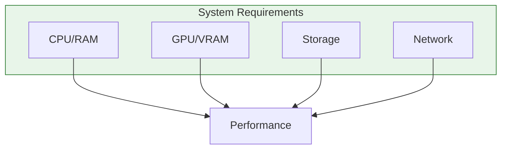
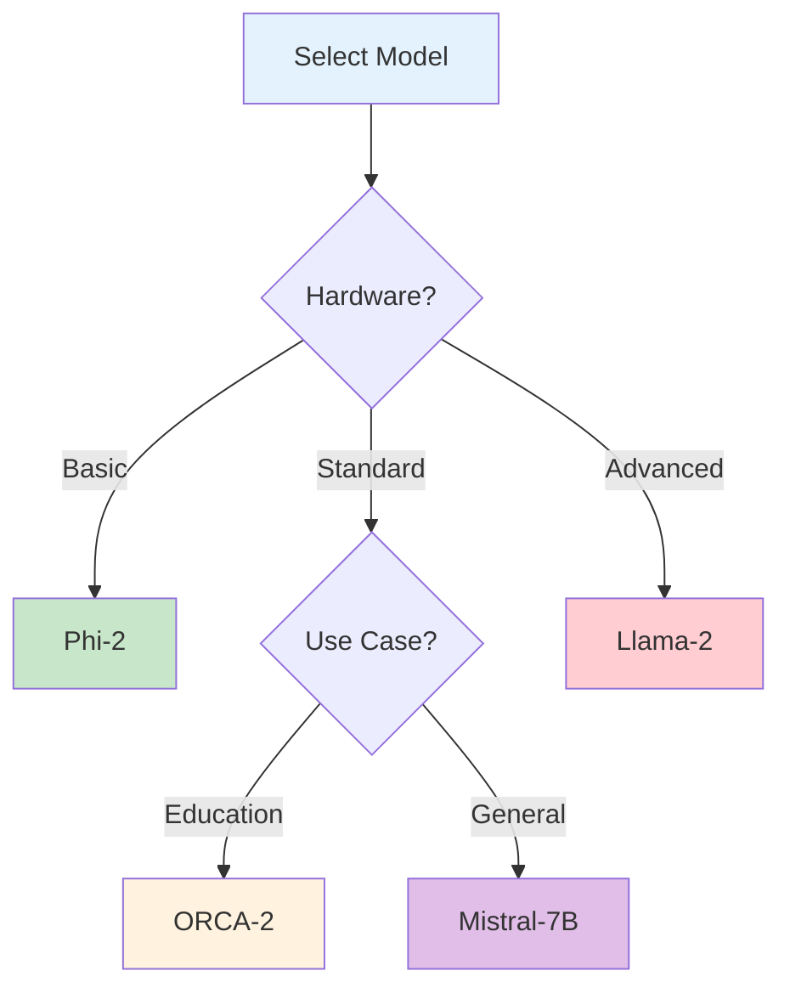

# Understanding and Working with Local LLMs

## 🧠 Introduction to LLMs

### What are LLMs?
Large Language Models (LLMs) are advanced AI systems trained on vast amounts of text data. They represent a breakthrough in natural language processing, enabling sophisticated language understanding and generation capabilities.

### Understanding Tokens and Context Windows

#### What are Tokens?
Tokens are the basic units that LLMs use to process text. They are not exactly words, but rather pieces of words that the model understands. Here's how tokenization works:

- A word might be split into multiple tokens
- Common words might be single tokens
- Rare words might be split into several tokens
- Special characters and spaces are also tokens

Examples:
```text
"Hello"          → 1 token
"understanding"  → 2 tokens (under + standing)
"chatbot"        → 2 tokens (chat + bot)
"!" or " "       → 1 token each
```

#### Context Window and Max Tokens

- **Context Window (e.g., 8192 tokens)**:
  - The total amount of text (in tokens) the model can consider at once
  - Includes both input (prompt) and output (response)
  - Like the model's "working memory"
  - Example: 8192 tokens ≈ 6000 words or about 20 pages of text

- **Max Tokens (e.g., 2048 tokens)**:
  - Maximum length of the model's response
  - Must be less than the context window
  - Controls how long the generated text can be
  - Example: 2048 tokens ≈ 1500 words or about 5 pages of text



#### Practical Implications
1. **Memory Management**
   - Longer context = More memory usage
   - Larger context window = Higher GPU/RAM requirements
   - Need to balance between context size and performance

2. **Cost Considerations**
   - More tokens = Higher processing cost
   - Need to optimize prompt length
   - Balance between detail and efficiency

3. **Performance Impact**
   - Larger context = Slower processing
   - Need to chunk long texts
   - Consider streaming for long responses



### Key Concepts

#### Transformer Architecture


#### Self-Attention Mechanism


## 🚀 Local LLMs Guide

### Latest LLM Models (2024)

| Model | Architecture | Parameters | Context | Best For |
|-------|-------------|------------|----------|----------|
| Phi | MoE | 16 x 3.8B | 4K | Math & Reasoning |
| Mistral | Dense | 7B | 8K | General Use |
| ORCA | Dense | 7B | 8K | Education |
| Llama | Dense | 7-65B | 8K | Research |

### System Requirements



| Component | Basic | Standard | Advanced |
|-----------|-------|----------|-----------|
| CPU | 4 cores | 8 cores | 16+ cores |
| RAM | 8GB | 16GB | 32GB+ |
| GPU | None | 6GB VRAM | 12GB+ VRAM |
| Storage | 10GB | 20GB | 50GB+ |

## ⚙️ LLM Optimization

### Key Parameters

#### Temperature Control
```python
def generate_response(prompt: str, temperature: float = 0.7) -> str:
    """
    Generate LLM response with temperature control.
    
    Args:
        prompt: Input text
        temperature: Controls randomness (0.0-1.0)
            - 0.2: More focused, deterministic
            - 0.7: Balanced creativity
            - 1.0: More random, creative
    """
    return llm.generate(
        prompt=prompt,
        temperature=temperature,
        max_tokens=1024
    )
```

#### Context Window Management
```python
def process_long_text(text: str, window_size: int = 4096) -> List[str]:
    """
    Process long text using sliding context window.
    
    Args:
        text: Long input text
        window_size: Context window size
    
    Returns:
        List of responses for each window
    """
    chunks = text_splitter.split_text(text, chunk_size=window_size)
    responses = []
    
    for chunk in chunks:
        response = llm.generate(chunk)
        responses.append(response)
    
    return responses
```

### Performance Tuning

#### CPU Optimization
```python
def optimize_cpu_inference():
    """Configure CPU-optimized inference settings."""
    return {
        "threads": multiprocessing.cpu_count(),
        "batch_size": 1,
        "quantization": "int8",
        "compute_type": "float16"
    }
```

#### GPU Acceleration
```python
def setup_gpu_inference():
    """Configure GPU-accelerated inference."""
    return {
        "device": "cuda",
        "precision": "float16",
        "memory_efficient": True,
        "batch_size": 4
    }
```

## 📊 Model Selection Guide

### Use Case Decision Tree


### Configuration Examples

```yaml
# config.yaml - Basic Setup
llm:
  model: mistral-7b
  temperature: 0.7
  max_tokens: 2048
  context_window: 8192

optimization:
  quantization: int8
  threads: 4
  batch_size: 1
  cuda_enabled: true

# Advanced Setup
advanced_llm:
  model: llama-2-13b
  temperature: 0.5
  max_tokens: 4096
  context_window: 16384
  
  optimization:
    quantization: int4
    threads: 8
    batch_size: 4
    cuda_layers: all
    kv_cache: true
```

## 🔍 Troubleshooting Guide

### Common Issues

| Issue | Possible Cause | Solution |
|-------|---------------|----------|
| High Latency | Large context window | Reduce window size |
| OOM Errors | Insufficient RAM/VRAM | Enable quantization |
| Poor Quality | Wrong temperature | Adjust parameters |
| CPU Bottleneck | Single threading | Enable multi-threading |

### Performance Monitoring
```python
def monitor_performance():
    """Monitor LLM inference performance."""
    metrics = {
        "latency": [],
        "memory_usage": [],
        "token_throughput": []
    }
    
    while True:
        # Track performance metrics
        latency = measure_latency()
        memory = measure_memory()
        throughput = measure_throughput()
        
        # Update metrics
        metrics["latency"].append(latency)
        metrics["memory_usage"].append(memory)
        metrics["token_throughput"].append(throughput)
        
        # Generate report
        if should_report():
            generate_performance_report(metrics) 