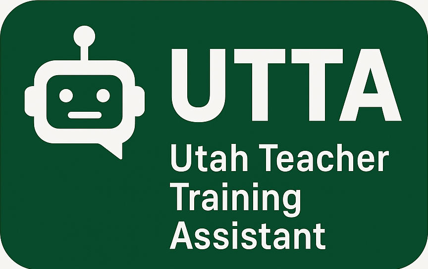

# Utah Teacher Training Assistant (UTTA)



A sophisticated AI-powered platform for teacher training that combines advanced language models, automated evaluation metrics, and an intuitive web interface to help educators improve their teaching skills through simulated student interactions.

## 🌟 Key Features

### 1. Interactive Teaching Simulation
- **Realistic Student Interactions:** Engage with AI-powered student personas across different grade levels and subjects
- **Scenario-Based Learning:** Practice teaching in various classroom situations and challenges
- **Real-time Feedback:** Receive immediate feedback on your teaching approaches
- **Subject Matter Expert Mode:** Contribute to and review teaching examples

### 2. Advanced Evaluation System
- **Multi-dimensional Assessment:** Evaluation across six key teaching dimensions:
  - Clarity (1-10)
  - Engagement (1-10)
  - Pedagogical Approach (1-10)
  - Emotional Support (1-10)
  - Content Accuracy (1-10)
  - Age Appropriateness (1-10)
- **Detailed Feedback:** Strengths, areas for improvement, and actionable recommendations
- **Visual Analytics:** Interactive charts and metrics visualization

### 3. Customizable Scenarios
- **Grade Levels:** From Kindergarten through 5th Grade
- **Subject Areas:** Mathematics, Science, Literacy, Social Studies, Art, Music, and Physical Education
- **Student Profiles:** Various learning styles and needs
- **Teaching Styles:** Multiple pedagogical approaches

### 4. Technical Features
- **DSPy Integration:** Optimized language model interactions
- **Knowledge Base Management:** Context-aware responses
- **Modern Web Interface:** Built with Streamlit for ease of use
- **Extensible Architecture:** Modular design for easy updates

## 🚀 Getting Started

### Prerequisites

- Python 3.9 or higher
- Conda package manager
- Git

### Quick Start

1. **Clone the Repository:**
   ```bash
   git clone https://github.com/UVU-AI-Innovate/UTTA.git
   cd UTTA
   ```

2. **Create and Activate Conda Environment:**
   ```bash
   conda create -n utta python=3.9
   conda activate utta
   ```

3. **Install Dependencies:**
   ```bash
   pip install -r requirements.txt
   ```

4. **Set Up Environment:**
   ```bash
   cp .env.example .env
   # Edit .env with your configuration
   ```

5. **Run the Application:**
   ```bash
   PYTHONPATH=src streamlit run src/web/simple_app.py
   ```

### 📁 Project Structure

```
UTTA/
├── src/                      # Source code
│   ├── core/                 # Core functionality
│   ├── evaluation/          # Evaluation metrics
│   │   └── metrics/        # Automated assessment
│   ├── llm/                 # Language model integration
│   │   └── dspy/          # DSPy framework adapters
│   └── web/                # Web interface
├── docs/                    # Documentation
│   ├── evaluation.md       # Evaluation system details
│   └── fine-tuning/       # Model fine-tuning guides
├── knowledge_base/         # Teaching resources
└── training_datasets/      # Training data
```

## 💡 Usage Guide

### Starting a Teaching Session

1. Launch the application and access it at `http://localhost:8501`
2. Use the sidebar to navigate between different modes:
   - **Chat:** Practice teaching with simulated students
   - **Evaluation:** Review your teaching performance
   - **Expert Mode:** Contribute teaching examples

### Creating a Teaching Scenario

1. Select "Create Scenario" from the interface
2. Follow the hierarchical selection process:
   - Choose grade level
   - Select subject area
   - Pick challenge type
   - Define student profile
   - Choose teaching style
3. Add scenario details and student question
4. Begin the teaching interaction

### Using the Evaluation System

1. Complete a teaching interaction
2. Navigate to the Evaluation section
3. Click "Evaluate Last Response"
4. Review your performance metrics and feedback
5. Use the recommendations to improve your approach

## 📚 Documentation

Detailed documentation is available in the `docs/` directory:
- [Evaluation System Guide](docs/evaluation.md)
- [Fine-tuning Documentation](docs/fine-tuning/README.md)

## 🤝 Contributing

We welcome contributions! Please see our [Contributing Guidelines](CONTRIBUTING.md) for details on how to:
- Report bugs
- Suggest enhancements
- Submit pull requests
- Contribute to documentation

## 📄 License

This project is licensed under the MIT License - see the [LICENSE](LICENSE) file for details.

## 🙏 Acknowledgments

- Utah Valley University AI Innovation Lab
- Contributing educators and subject matter experts
- Open source community and contributors

## 📞 Support

For support and questions:
- Create an issue in the GitHub repository
- Contact the development team
- Join our community discussions

---
Built with ❤️ by the UVU AI Innovation Lab Team 