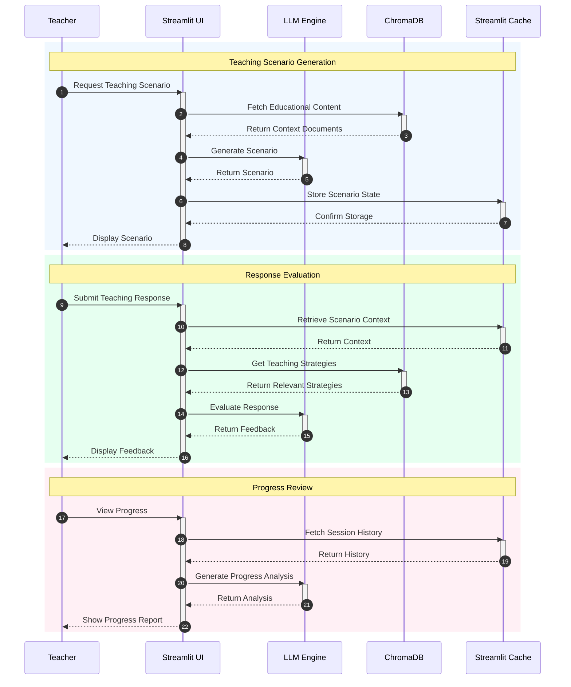
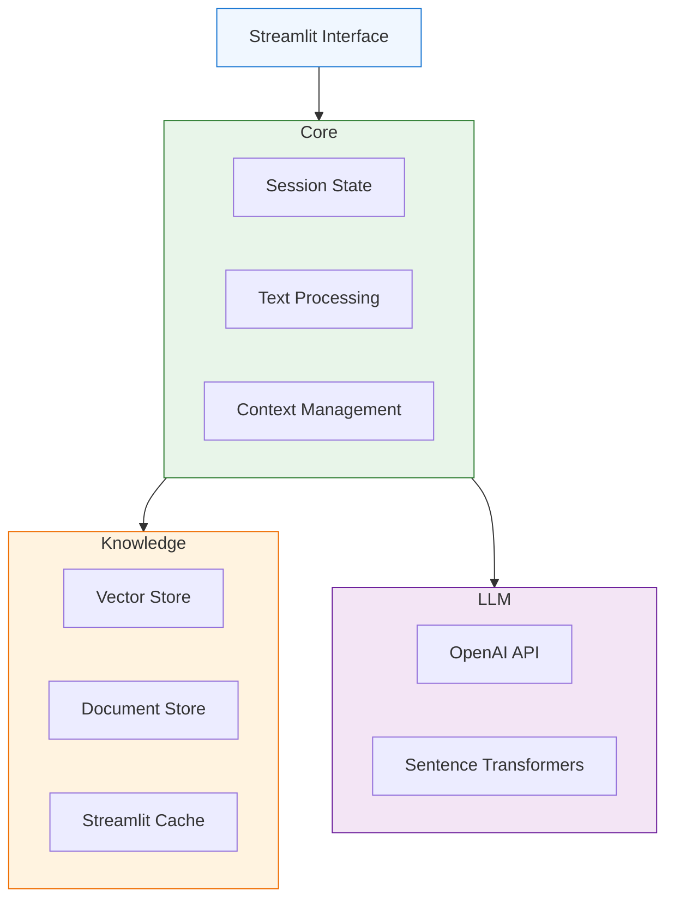

# UTTA System Architecture

## 🏗️ System Overview

UTTA is built as a Streamlit application that integrates LLMs with educational content to provide an interactive teacher training experience.

### Interaction Flow

### Component Architecture

### Core Components

1. **Streamlit Interface**
   - Interactive web interface
   - Real-time response display
   - Session state management
   - File upload handling

2. **LLM Integration**
   - OpenAI API integration
   - Context management
   - Prompt optimization
   - Response generation

3. **Knowledge Management**
   - Vector embeddings storage
   - Semantic search functionality
   - Educational content processing
   - Context retrieval

## 🔌 Integration Points

### Component Communication
- Streamlit session state for data persistence
- Callback functions for user interactions
- State management through Streamlit primitives
- File handling through Streamlit's file uploader

### Data Storage
- ChromaDB for vector embeddings
- Local file system for document storage
- Streamlit cache for performance optimization

### External Services
- OpenAI API for LLM capabilities
- Sentence transformers for embeddings
- HuggingFace for model access

## 🔐 Security Considerations

1. **API Security**
   - Secure API key management
   - Environment variable configuration
   - Rate limiting implementation

2. **Data Protection**
   - Local data storage security
   - User input validation
   - Session data management

## 📈 Performance

1. **Optimization**
   - Streamlit caching mechanisms
   - Batch processing for embeddings
   - Efficient context window usage

2. **Resource Management**
   - Memory-efficient operations
   - Optimized API calls
   - Cache management

3. **Monitoring**
   - Error logging
   - Performance tracking
   - Usage analytics 