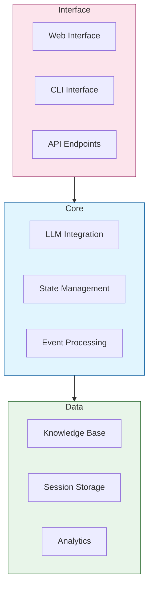
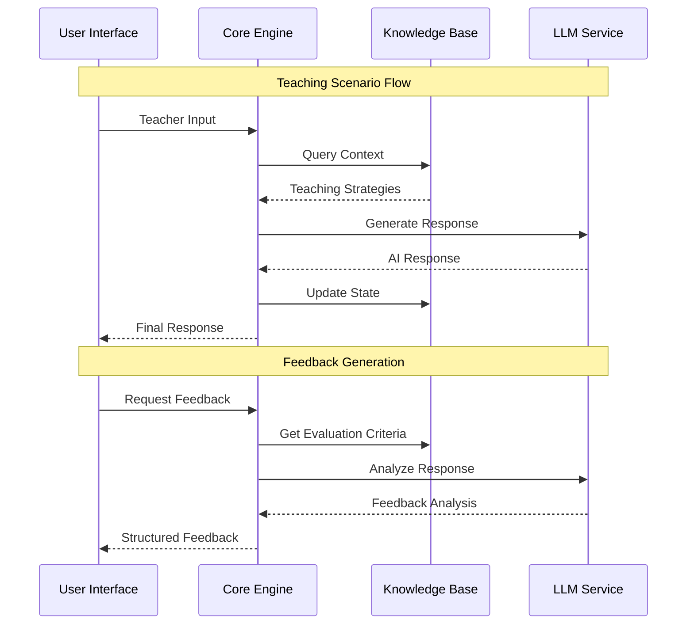
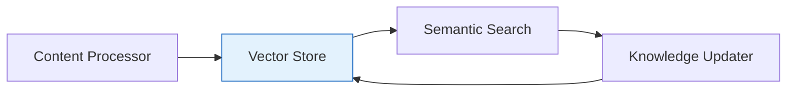
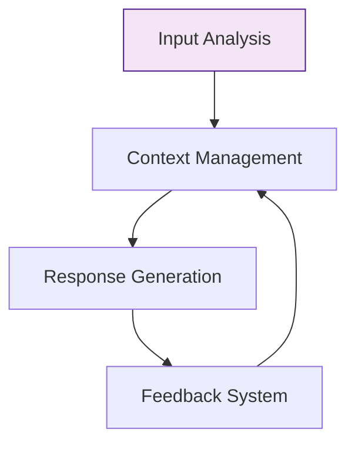
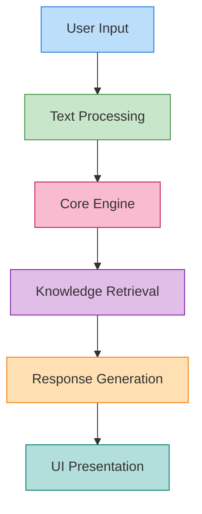
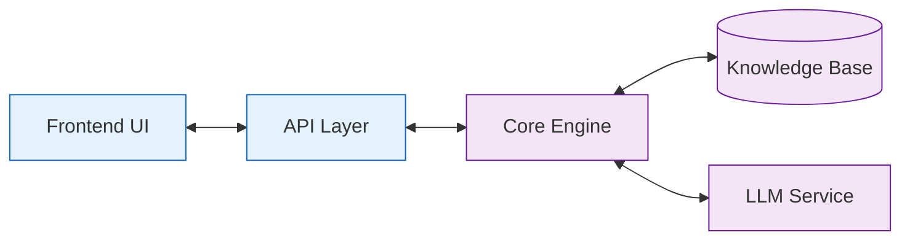
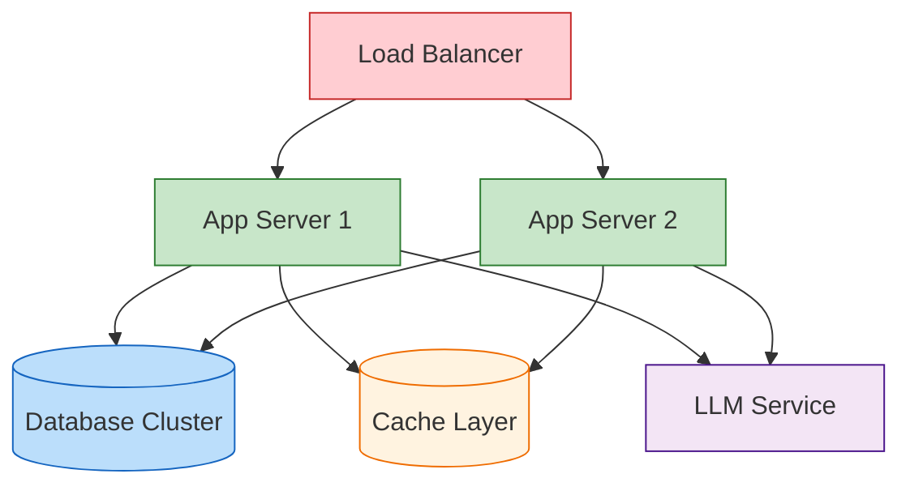
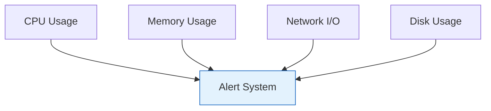

# UTTA System Architecture

## 🏗️ System Overview

The UTTA system is designed as a modular, extensible platform for AI-powered teacher training. This guide covers the system's architecture and component interactions.

### High-Level Architecture

### Component Interactions

## 🔧 Core Components

### Teacher Training Agent
- **Scenario Generation**
  - Creates realistic teaching situations
  - Adapts difficulty levels
  - Maintains educational context

- **Component Coordination**
  - Manages inter-component communication
  - Ensures data consistency
  - Handles state transitions

- **Progress Tracking**
  - Monitors teaching effectiveness
  - Records improvement metrics
  - Generates progress reports

### Knowledge Manager

### Language Processor

## 📊 Data Flow

The UTTA system follows a structured data flow pattern that processes user inputs through multiple stages to generate appropriate educational responses.

### Process Flow Diagram

### Component Flow

Each stage in the process flow serves a specific purpose:

1. **User Input**
   - Captures text input from teachers
   - Handles various input formats
   - Validates input parameters

2. **Text Processing**
   - Tokenization and normalization
   - Language detection
   - Intent classification

3. **Core Engine**
   - LLM integration
   - Context management
   - Prompt optimization

4. **Knowledge Retrieval**
   - Vector database queries
   - Semantic search
   - Context ranking

5. **Response Generation**
   - Template selection
   - Content generation
   - Response validation

6. **UI Presentation**
   - Format response
   - Apply styling
   - Handle interactions

## 🔌 Integration Points

### Component Interfaces

1. **Event-Driven Communication**
   - WebSocket connections for real-time updates
   - Event queues for asynchronous processing
   - State management broadcasts

2. **API Endpoints**
   - REST APIs for CRUD operations
   - GraphQL interface for complex queries
   - Streaming endpoints for continuous data

3. **Database Connections**
   - Vector store for embeddings
   - Document store for content
   - Cache layer for performance

### System Integration

## 🔐 Security Layer

1. **Authentication**
   - JWT token validation
   - Role-based access control
   - Session management

2. **Data Protection**
   - Encryption at rest
   - Secure communication channels
   - PII data handling

3. **Monitoring**
   - Access logs
   - Error tracking
   - Performance metrics

## 📈 Scalability Design

1. **Horizontal Scaling**
   - Load balancing
   - Service replication
   - Distributed caching

2. **Resource Management**
   - Auto-scaling policies
   - Resource quotas
   - Performance optimization

3. **High Availability**
   - Failover mechanisms
   - Data replication
   - Health monitoring

## 🚀 Deployment Architecture

### Infrastructure Components

### Scaling Considerations
- **Horizontal Scaling**
  - Web server replication
  - Load distribution
  - Session management

- **Vertical Scaling**
  - LLM processing
  - Database optimization
  - Cache management

- **Resource Management**
  - Auto-scaling policies
  - Resource monitoring
  - Performance metrics

## 🔍 System Monitoring

### Performance Metrics

### Health Checks
1. **Component Health**
   - Service availability
   - Response times
   - Error rates

2. **Resource Usage**
   - CPU/Memory utilization
   - Disk space
   - Network bandwidth

3. **Model Performance**
   - Inference latency
   - Token throughput
   - Memory efficiency 