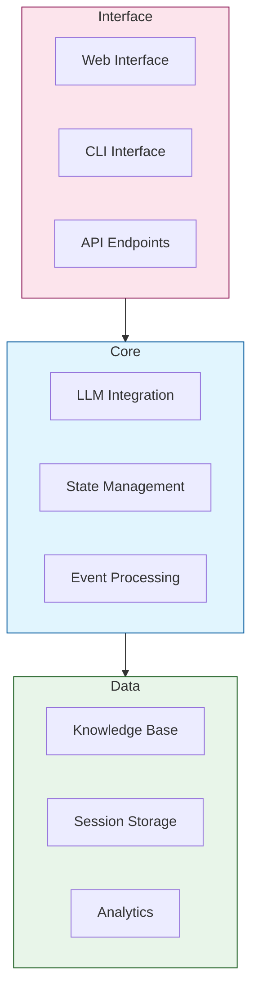
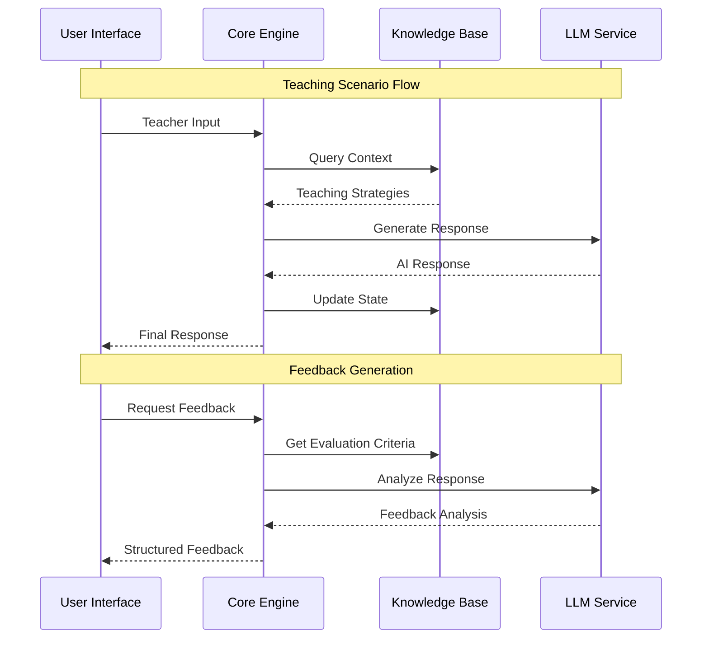
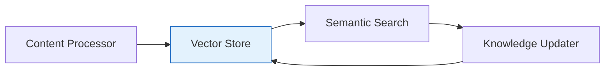
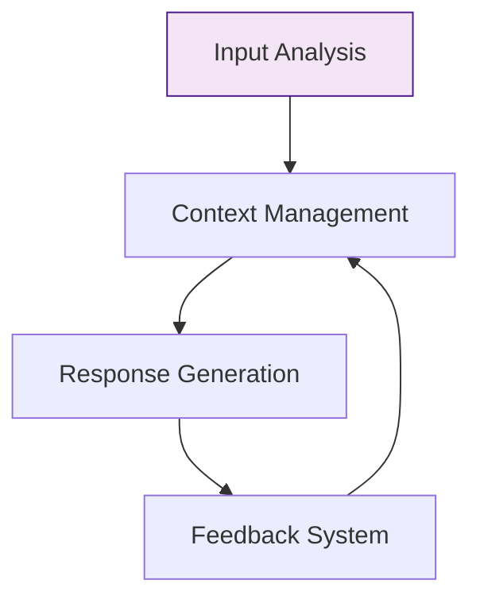
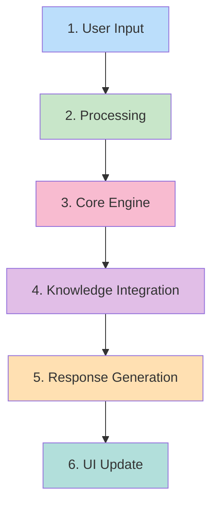
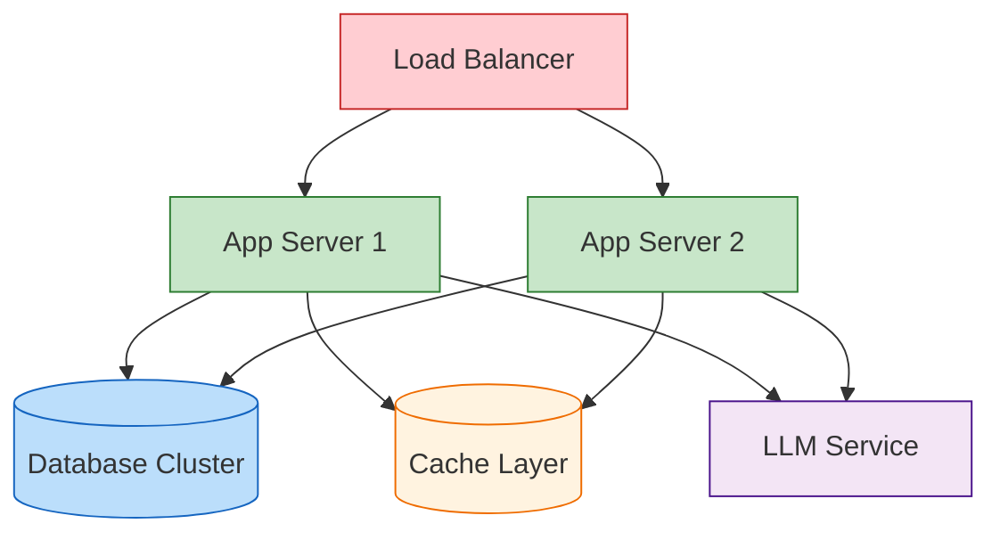
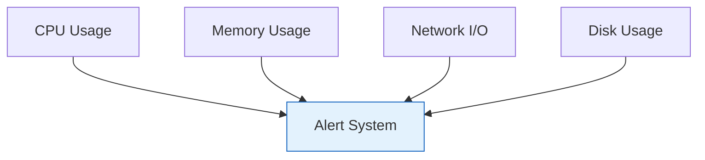

# UTTA System Architecture

## 🏗️ System Overview

The UTTA system is designed as a modular, extensible platform for AI-powered teacher training. This guide covers the system's architecture and component interactions.

### High-Level Architecture



### Component Interactions



## 🔧 Core Components

### Teacher Training Agent
- **Scenario Generation**
  - Creates realistic teaching situations
  - Adapts difficulty levels
  - Maintains educational context

- **Component Coordination**
  - Manages inter-component communication
  - Ensures data consistency
  - Handles state transitions

- **Progress Tracking**
  - Monitors teaching effectiveness
  - Records improvement metrics
  - Generates progress reports

### Knowledge Manager


### Language Processor


## 📊 Data Flow

### Process Flow


## 🔌 Integration Points

### Component Interfaces
- **Event-Driven Communication**
  ```json
  {
    "event_type": "teaching_response",
    "data": {
      "input": "teacher_action",
      "context": "scenario_details",
      "timestamp": "iso_datetime"
    }
  }
  ```

- **API Endpoints**
  ```yaml
  /api/v1:
    /scenarios:
      - GET: List available scenarios
      - POST: Create new scenario
    /responses:
      - POST: Submit teaching response
      - GET: Get feedback
    /progress:
      - GET: View teaching progress
  ```

### Extension Guidelines
1. **Interface Standards**
   - Use standard event formats
   - Follow REST principles
   - Implement error handling

2. **Architecture Patterns**
   - Event-driven design
   - Microservices approach
   - Loose coupling

3. **Documentation**
   - API specifications
   - Event schemas
   - Integration examples

## 🚀 Deployment Architecture

### Infrastructure Components


### Scaling Considerations
- **Horizontal Scaling**
  - Web server replication
  - Load distribution
  - Session management

- **Vertical Scaling**
  - LLM processing
  - Database optimization
  - Cache management

- **Resource Management**
  - Auto-scaling policies
  - Resource monitoring
  - Performance metrics

## 🔍 System Monitoring

### Performance Metrics


### Health Checks
1. **Component Health**
   - Service availability
   - Response times
   - Error rates

2. **Resource Usage**
   - CPU/Memory utilization
   - Disk space
   - Network bandwidth

3. **Model Performance**
   - Inference latency
   - Token throughput
   - Memory efficiency 