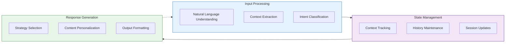
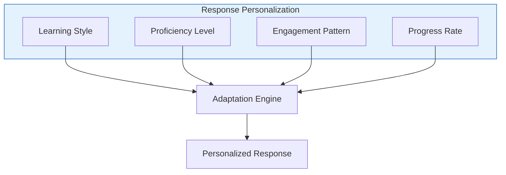
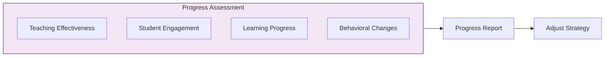

# Chapter 8: Building Educational Chatbots

[]() 
[]()

## Learning Objectives

By the end of this chapter, you'll be able to:
- Design educational chatbot architectures that support effective learning experiences
- Implement conversation management systems for tracking context and student progress
- Create personalization strategies that adapt to individual learning needs
- Build comprehensive assessment and feedback mechanisms
- Deploy and evaluate educational chatbots in real-world scenarios

## 8.1 Educational Chatbot Architecture

### 8.1.1 Interaction Flow

The core architecture of an educational chatbot follows this pattern:



### 8.1.2 Conversation Lifecycle

Educational chatbots operate through a structured lifecycle:

1. **Initialization**
   - Load user profiles and learning preferences
   - Initialize conversation state and learning objectives
   - Set up tracking metrics and evaluation criteria

2. **Active Interaction**
   - Process user inputs and extract learning needs
   - Generate appropriate educational responses
   - Track engagement levels and learning progress

3. **Progress Monitoring**
   - Evaluate teaching effectiveness continuously
   - Adjust difficulty levels based on performance
   - Provide real-time feedback on learning progress

4. **Session Completion**
   - Generate comprehensive session summaries
   - Save progress data for longitudinal analysis
   - Provide improvement suggestions and learning paths

## 8.2 Conversation Management

Effective educational chatbots require sophisticated conversation management.

### 8.2.1 Context Tracking

```python
class ConversationContext:
    def __init__(self):
        self.history = []
        self.current_topic = None
        self.student_state = StudentState()
        self.teaching_goals = TeachingGoals()

    def update(self, message: Message):
        """Update conversation context with new message."""
        self.history.append(message)
        self._update_topic(message)
        self._update_student_state(message)
        self._check_teaching_goals(message)

    def get_relevant_context(self, window_size: int = 5):
        """Get recent context for response generation."""
        return {
            'history': self.history[-window_size:],
            'topic': self.current_topic,
            'student_state': self.student_state.current,
            'goals': self.teaching_goals.pending
        }
        
    def _update_topic(self, message):
        """Extract and update the current conversation topic."""
        # Use NLP to extract topic from message
        topic_extractor = TopicExtractor()
        detected_topic = topic_extractor.extract(message.content)
        
        # If confidence is high enough, update the topic
        if detected_topic.confidence > 0.7:
            self.current_topic = detected_topic.name
            
    def _update_student_state(self, message):
        """Update the student's cognitive and emotional state."""
        # Analyze message for cognitive state
        cognition = CognitiveAnalyzer.analyze(message.content)
        
        # Analyze message for emotional state
        emotion = EmotionAnalyzer.analyze(message.content)
        
        # Update student state
        self.student_state.update(cognition, emotion)
        
    def _check_teaching_goals(self, message):
        """Evaluate progress toward teaching goals."""
        # Check which goals are addressed
        addressed_goals = []
        for goal in self.teaching_goals.pending:
            if goal.is_addressed_by(message):
                addressed_goals.append(goal)
                
        # Update goal status
        for goal in addressed_goals:
            self.teaching_goals.mark_progress(goal.id, message)
```

### 8.2.2 Memory Management

Educational chatbots need multiple memory systems:

| Memory Type | Purpose | Implementation |
|-------------|---------|----------------|
| Short-term | Current conversation | In-memory queue with size limit |
| Working | Active learning tasks | Priority queue with decay function |
| Long-term | User profile & history | Persistent storage with semantic indexing |
| Episodic | Past learning scenarios | Vector database with retrieval mechanisms |

### 8.2.3 Dialog Management

```python
class DialogManager:
    def __init__(self, llm_client, knowledge_base):
        self.context = ConversationContext()
        self.history = []
        self.llm = llm_client
        self.knowledge_base = knowledge_base
        
    def process_input(self, user_input):
        """Process user input and generate response."""
        # Update context with user input
        user_message = Message(content=user_input, sender="user")
        self.context.update(user_message)
        
        # Generate response using context and knowledge
        response = self._generate_response(user_input)
        
        # Update context with system response
        system_message = Message(content=response, sender="system")
        self.context.update(system_message)
        
        # Update history
        self._update_history(user_input, response)
        
        return response
        
    def _generate_response(self, user_input):
        """Generate response using LLM and knowledge base."""
        # Get relevant context
        context = self.context.get_relevant_context()
        
        # Retrieve relevant knowledge
        knowledge = self.knowledge_base.search(
            query=user_input,
            context=context
        )
        
        # Create prompt with context and knowledge
        prompt = self._create_prompt(user_input, context, knowledge)
        
        # Generate response
        response = self.llm.generate(prompt)
        
        return response
        
    def _create_prompt(self, user_input, context, knowledge):
        """Create LLM prompt with context and knowledge."""
        # Format conversation history
        history_text = self._format_history(context['history'])
        
        # Format knowledge
        knowledge_text = self._format_knowledge(knowledge)
        
        # Create educational prompt
        prompt = f"""
        You are an educational assistant helping students learn.
        
        CONVERSATION HISTORY:
        {history_text}
        
        CURRENT TOPIC: {context['topic']}
        
        STUDENT STATE:
        - Understanding: {context['student_state']['understanding_level']}
        - Engagement: {context['student_state']['engagement_level']}
        
        LEARNING GOALS:
        {self._format_goals(context['goals'])}
        
        RELEVANT KNOWLEDGE:
        {knowledge_text}
        
        USER INPUT: {user_input}
        
        Provide a helpful, educational response that:
        1. Addresses the student's question or comment
        2. Uses relevant knowledge to provide accurate information
        3. Advances the current learning goals
        4. Adapts to the student's current understanding level
        5. Encourages further engagement and inquiry
        
        RESPONSE:
        """
        
        return prompt
        
    def _update_history(self, user_input, response):
        """Update conversation history."""
        self.history.append({
            'user': user_input,
            'system': response,
            'timestamp': datetime.now().isoformat()
        })
```

## 8.3 Educational Features

Educational chatbots require specialized features to support effective learning.

### 8.3.1 Personalization

Adapt responses to individual learner needs:



```python
class PersonalizationEngine:
    def __init__(self, user_profile):
        self.profile = user_profile
        
    def personalize_response(self, base_response, learning_context):
        """Personalize response based on user profile and context."""
        # Apply personalization transformations
        personalized = base_response
        
        # Adjust for learning style
        personalized = self._adapt_to_learning_style(
            personalized, 
            self.profile.learning_style
        )
        
        # Adjust for proficiency level
        personalized = self._adapt_to_proficiency(
            personalized,
            self.profile.proficiency_level,
            learning_context.current_topic
        )
        
        # Adjust for engagement pattern
        personalized = self._adjust_engagement(
            personalized,
            learning_context.engagement_metrics
        )
        
        return personalized
        
    def _adapt_to_learning_style(self, response, learning_style):
        """Adapt content to learning style preference."""
        if learning_style == "visual":
            # Add visual elements or descriptions
            response = self._enhance_with_visual_elements(response)
        elif learning_style == "auditory":
            # Emphasize verbal explanations
            response = self._enhance_with_verbal_patterns(response)
        elif learning_style == "kinesthetic":
            # Emphasize practical applications
            response = self._enhance_with_practical_examples(response)
            
        return response
        
    def _adapt_to_proficiency(self, response, proficiency, topic):
        """Adapt content to proficiency level."""
        if proficiency == "beginner":
            # Simplify concepts and vocabulary
            response = self._simplify_content(response, topic)
        elif proficiency == "intermediate":
            # Balance depth with accessibility
            response = response  # Already balanced
        elif proficiency == "advanced":
            # Add depth and complexity
            response = self._enhance_with_depth(response, topic)
            
        return response
```

### 8.3.2 Progress Assessment

Continuously evaluate learning progress:



```python
class ProgressAssessment:
    def __init__(self, learning_objectives):
        self.objectives = learning_objectives
        self.metrics = {
            'conceptual_understanding': 0.0,
            'skill_proficiency': 0.0,
            'engagement_level': 0.0,
            'completion_rate': 0.0
        }
        self.history = []
        
    def update(self, interaction, assessment_results=None):
        """Update progress assessment based on interaction."""
        # Update from direct assessment if available
        if assessment_results:
            self._update_from_assessment(assessment_results)
            
        # Update from interaction analysis
        self._update_from_interaction(interaction)
        
        # Record history
        self._record_history()
        
    def generate_report(self):
        """Generate progress report."""
        return {
            'current_metrics': self.metrics,
            'progress_over_time': self._calculate_progress_trends(),
            'strengths': self._identify_strengths(),
            'areas_for_improvement': self._identify_improvement_areas(),
            'recommendations': self._generate_recommendations()
        }
        
    def _update_from_assessment(self, results):
        """Update metrics from direct assessment results."""
        for metric, value in results.items():
            if metric in self.metrics:
                self.metrics[metric] = value
                
    def _update_from_interaction(self, interaction):
        """Update metrics based on interaction analysis."""
        # Analyze interaction for understanding indicators
        understanding = self._analyze_understanding(interaction)
        
        # Analyze interaction for skill indicators
        skill = self._analyze_skill_application(interaction)
        
        # Analyze engagement
        engagement = self._analyze_engagement(interaction)
        
        # Update metrics with weighted averaging
        self.metrics['conceptual_understanding'] = (
            self.metrics['conceptual_understanding'] * 0.7 + understanding * 0.3
        )
        self.metrics['skill_proficiency'] = (
            self.metrics['skill_proficiency'] * 0.7 + skill * 0.3
        )
        self.metrics['engagement_level'] = (
            self.metrics['engagement_level'] * 0.7 + engagement * 0.3
        )
```

### 8.3.3 Adaptive Feedback

Provide targeted feedback based on learning needs:

```python
class FeedbackSystem:
    def generate_feedback(self, interaction, progress_assessment):
        """Generate comprehensive feedback."""
        return {
            'immediate': self._immediate_feedback(interaction),
            'analytical': self._analytical_feedback(interaction, progress_assessment),
            'constructive': self._constructive_feedback(interaction, progress_assessment),
            'summative': self._summative_feedback(progress_assessment)
        }
        
    def _immediate_feedback(self, interaction):
        """Generate immediate response validation."""
        # Analyze response correctness
        correctness = self._analyze_correctness(interaction.user_response)
        
        # Generate appropriate feedback
        if correctness > 0.8:
            return {
                'type': 'positive',
                'message': f"Excellent work! Your response is accurate and well-structured.",
                'score': correctness
            }
        elif correctness > 0.5:
            return {
                'type': 'mixed',
                'message': f"Good effort! Your response contains some correct elements, but could be improved.",
                'score': correctness,
                'correction': self._generate_correction(interaction)
            }
        else:
            return {
                'type': 'corrective',
                'message': f"Let's revisit this concept. Your response needs improvement.",
                'score': correctness,
                'correction': self._generate_correction(interaction),
                'explanation': self._generate_explanation(interaction)
            }
```

## 8.4 Implementation Approach

### 8.4.1 Core Chatbot Implementation

```python
class EducationalChatbot:
    def __init__(self, config):
        # Initialize components
        self.llm = self._initialize_llm(config['llm'])
        self.knowledge_base = self._initialize_knowledge_base(config['knowledge'])
        self.dialog_manager = DialogManager(self.llm, self.knowledge_base)
        self.personalization = PersonalizationEngine(config['user_profile'])
        self.assessment = ProgressAssessment(config['learning_objectives'])
        self.feedback = FeedbackSystem()
        
    def process_message(self, user_message):
        """Process user message and generate response."""
        # Process input through dialog manager
        base_response = self.dialog_manager.process_input(user_message)
        
        # Get current learning context
        learning_context = self.dialog_manager.context.get_relevant_context()
        
        # Personalize response
        personalized_response = self.personalization.personalize_response(
            base_response,
            learning_context
        )
        
        # Create interaction record
        interaction = Interaction(
            user_message=user_message,
            system_response=personalized_response,
            context=learning_context
        )
        
        # Update assessment
        self.assessment.update(interaction)
        
        # Generate feedback if appropriate
        feedback = None
        if self._should_provide_feedback(interaction):
            feedback = self.feedback.generate_feedback(
                interaction,
                self.assessment
            )
            # Enhance response with feedback
            personalized_response = self._integrate_feedback(
                personalized_response,
                feedback
            )
            
        return {
            'response': personalized_response,
            'feedback': feedback,
            'assessment': self.assessment.generate_report() 
                if self._should_provide_assessment(interaction) 
                else None
        }
        
    def _initialize_llm(self, config):
        """Initialize language model client."""
        if config['provider'] == 'openai':
            return OpenAIClient(config['api_key'], config['model'])
        elif config['provider'] == 'anthropic':
            return AnthropicClient(config['api_key'], config['model'])
        elif config['provider'] == 'local':
            return LocalLLMClient(config['model_path'])
            
    def _initialize_knowledge_base(self, config):
        """Initialize knowledge base."""
        if config['type'] == 'vector':
            return VectorKnowledgeBase(config['path'])
        elif config['type'] == 'graph':
            return GraphKnowledgeBase(config['path'])
```

### 8.4.2 Best Practices

For effective educational chatbots, follow these implementation guidelines:

1. **Teaching Persona**
   - Maintain a consistent, supportive personality
   - Use age-appropriate language and explanations
   - Show empathy and patience with struggling learners
   - Adjust tone for different educational contexts

2. **Error Handling**
   - Implement graceful fallback responses
   - Provide clear guidance when user inputs are unclear
   - Use knowledge gaps as teaching opportunities
   - Recognize and recover from conversation breakdowns

3. **Quality Monitoring**
   - Track key conversation and learning metrics
   - Monitor engagement levels across sessions
   - Analyze teaching effectiveness systematically
   - Identify patterns requiring intervention

4. **Learning Objective Alignment**
   - Maintain clear connections to curriculum objectives
   - Track progress against specific learning goals
   - Provide appropriate recognition for achievements
   - Adjust difficulty based on mastery level

5. **Assessment Integration**
   - Incorporate regular formative assessments
   - Balance assessment with engagement
   - Provide detailed performance analytics
   - Use assessment data to personalize learning

## 8.5 Hands-On Exercise: Building a Simple Educational Chatbot

Let's implement a basic educational chatbot for teaching programming concepts:

```python
import argparse
import json
import os
import time
from datetime import datetime
import openai

class ProgrammingTutor:
    def __init__(self, openai_api_key=None):
        """Initialize the programming tutor chatbot."""
        # Set up OpenAI client
        if openai_api_key:
            openai.api_key = openai_api_key
        else:
            openai.api_key = os.getenv("OPENAI_API_KEY")
            
        # Initialize conversation state
        self.conversation_history = []
        self.student_profile = {
            "proficiency": "beginner",
            "learning_style": "visual",
            "topics_covered": [],
            "strengths": [],
            "areas_for_improvement": []
        }
        
        # Define learning objectives
        self.learning_objectives = [
            "Understand basic programming concepts",
            "Write simple Python functions",
            "Debug common programming errors",
            "Apply programming concepts to solve problems"
        ]
        
        # Load programming knowledge snippets
        self.knowledge = self._load_knowledge()
        
    def _load_knowledge(self):
        """Load programming knowledge snippets."""
        # In a real system, this would load from a database
        return {
            "variables": {
                "concept": "Variables are containers for storing data values.",
                "examples": [
                    "x = 5  # Integer variable",
                    "name = 'John'  # String variable",
                    "is_active = True  # Boolean variable"
                ],
                "common_errors": [
                    "Using a variable before assigning a value",
                    "Using the wrong case (Python is case-sensitive)"
                ]
            },
            "functions": {
                "concept": "Functions are reusable blocks of code that perform a specific task.",
                "examples": [
                    "def greet(name):\n    return f'Hello, {name}!'",
                    "def add(a, b):\n    return a + b"
                ],
                "common_errors": [
                    "Forgetting to return a value",
                    "Incorrect indentation",
                    "Function name conflicts with built-ins"
                ]
            },
            "loops": {
                "concept": "Loops allow you to execute a block of code multiple times.",
                "examples": [
                    "for i in range(5):\n    print(i)",
                    "while count > 0:\n    count -= 1"
                ],
                "common_errors": [
                    "Infinite loops",
                    "Off-by-one errors",
                    "Forgetting to update the counter in while loops"
                ]
            }
        }
        
    def chat(self, user_input):
        """Process user input and generate a response."""
        # Add user input to conversation history
        self.conversation_history.append({
            "role": "user",
            "content": user_input,
            "timestamp": datetime.now().isoformat()
        })
        
        # Analyze the input for topic and learning needs
        analysis = self._analyze_input(user_input)
        
        # Retrieve relevant knowledge
        knowledge = self._retrieve_knowledge(analysis["topic"])
        
        # Generate response
        response = self._generate_response(user_input, analysis, knowledge)
        
        # Add response to conversation history
        self.conversation_history.append({
            "role": "assistant",
            "content": response,
            "timestamp": datetime.now().isoformat()
        })
        
        # Update student profile
        self._update_student_profile(user_input, analysis)
        
        return response
        
    def _analyze_input(self, user_input):
        """Analyze user input for topic and learning needs."""
        # In a real system, this would use NLP for better analysis
        analysis = {
            "topic": "general",
            "intent": "question",
            "complexity": "basic"
        }
        
        # Simple keyword-based topic detection
        topics = {
            "variables": ["variable", "var", "assign", "value", "store"],
            "functions": ["function", "def", "return", "call", "parameter", "argument"],
            "loops": ["loop", "for", "while", "iterate", "iteration"]
        }
        
        for topic, keywords in topics.items():
            if any(keyword in user_input.lower() for keyword in keywords):
                analysis["topic"] = topic
                break
                
        # Simple intent detection
        if "?" in user_input:
            analysis["intent"] = "question"
        elif "help" in user_input.lower() or "explain" in user_input.lower():
            analysis["intent"] = "help"
        elif "error" in user_input.lower() or "wrong" in user_input.lower():
            analysis["intent"] = "debugging"
            
        return analysis
        
    def _retrieve_knowledge(self, topic):
        """Retrieve relevant knowledge for the topic."""
        if topic in self.knowledge:
            return self.knowledge[topic]
        else:
            # Return general programming knowledge if topic not found
            return {
                "concept": "Programming is the process of creating instructions for computers to follow.",
                "examples": [
                    "print('Hello, World!')",
                    "x = 5 + 3"
                ],
                "common_errors": [
                    "Syntax errors",
                    "Logic errors",
                    "Runtime errors"
                ]
            }
            
    def _generate_response(self, user_input, analysis, knowledge):
        """Generate a response using the LLM."""
        # Format conversation history
        formatted_history = []
        for entry in self.conversation_history[-5:]:  # Last 5 entries
            formatted_history.append(f"{entry['role'].title()}: {entry['content']}")
        history_text = "\n".join(formatted_history)
        
        # Format knowledge
        knowledge_text = f"CONCEPT: {knowledge['concept']}\n\nEXAMPLES:\n"
        for example in knowledge['examples']:
            knowledge_text += f"- {example}\n"
        knowledge_text += "\nCOMMON ERRORS:\n"
        for error in knowledge['common_errors']:
            knowledge_text += f"- {error}\n"
            
        # Create prompt
        prompt = f"""
        You are a helpful programming tutor assisting a {self.student_profile['proficiency']} student who prefers {self.student_profile['learning_style']} learning.
        
        CONVERSATION HISTORY:
        {history_text}
        
        LEARNING OBJECTIVES:
        {', '.join(self.learning_objectives)}
        
        RELEVANT KNOWLEDGE:
        {knowledge_text}
        
        STUDENT QUESTION:
        {user_input}
        
        ANALYSIS:
        Topic: {analysis['topic']}
        Intent: {analysis['intent']}
        
        Please respond as a supportive tutor with:
        1. A clear explanation tailored to their proficiency level
        2. Relevant coding examples to illustrate concepts
        3. Practice suggestions to reinforce learning
        4. Encouragement and a positive learning tone
        
        Keep explanations concise and engaging. For {self.student_profile['learning_style']} learners, emphasize {'visual representations' if self.student_profile['learning_style'] == 'visual' else 'hands-on practice' if self.student_profile['learning_style'] == 'kinesthetic' else 'clear verbal explanations'}.
        
        YOUR RESPONSE:
        """
        
        # Call OpenAI API
        response = openai.Completion.create(
            model="gpt-3.5-turbo-instruct",
            prompt=prompt,
            max_tokens=800,
            temperature=0.7
        )
        
        return response.choices[0].text.strip()
        
    def _update_student_profile(self, user_input, analysis):
        """Update student profile based on interaction."""
        # Add topic to covered topics if not already there
        if analysis["topic"] not in self.student_profile["topics_covered"]:
            self.student_profile["topics_covered"].append(analysis["topic"])
            
        # In a real system, this would do more sophisticated profiling
        # based on the content and quality of student interactions
        
        # For this simple example, we'll just track engagement
        # If the student asks complex questions, increase proficiency
        if len(user_input.split()) > 15 and "?" in user_input:
            if self.student_profile["proficiency"] == "beginner":
                self.student_profile["proficiency"] = "intermediate"
            elif self.student_profile["proficiency"] == "intermediate" and len(self.conversation_history) > 10:
                self.student_profile["proficiency"] = "advanced"

# Example usage
if __name__ == "__main__":
    parser = argparse.ArgumentParser(description="Programming Tutor Chatbot")
    parser.add_argument("--api-key", help="OpenAI API key")
    
    args = parser.parse_args()
    
    tutor = ProgrammingTutor(args.api_key)
    
    print("🤖 Programming Tutor: Hello! I'm your programming tutor. Ask me anything about Python programming.")
    
    try:
        while True:
            user_input = input("\n👨‍💻 You: ")
            
            if user_input.lower() in ["exit", "quit", "bye"]:
                print("🤖 Programming Tutor: Goodbye! Happy coding!")
                break
                
            response = tutor.chat(user_input)
            print(f"\n🤖 Programming Tutor: {response}")
            
    except KeyboardInterrupt:
        print("\n🤖 Programming Tutor: Session ended. Keep practicing your coding skills!")
```

## 8.6 Key Takeaways

- Educational chatbots require specialized architectures focused on learning outcomes
- Effective conversation management is essential for maintaining educational context
- Personalization adapts content to individual learning styles and proficiency levels
- Progress assessment provides insights for both learners and educators
- Well-designed feedback systems are critical for effective learning

## 8.7 Chapter Project: Educational Assistant

For this chapter's project, you'll build an educational assistant for a subject of your choice:

1. Design the chatbot architecture and learning objectives
2. Implement a conversation management system with history tracking
3. Create a knowledge base of educational content in your chosen domain
4. Develop a personalization system that adapts to different learners
5. Implement assessment and feedback mechanisms
6. Test your chatbot with sample learning scenarios
7. Evaluate effectiveness and refine your implementation

## References

- Winkler, R., & Söllner, M. (2018). *Unleashing the Potential of Chatbots in Education*
- Smutny, P., & Schreiberova, P. (2020). *Chatbots for Learning: A Review of Educational Chatbots*
- Goel, A., & Polepeddi, L. (2017). *Jill Watson: A Virtual Teaching Assistant for Online Education*

## Further Reading

- [Chapter 5: Vector Store Implementation](Vector-Store-Implementation)
- [Chapter 6: Knowledge Applications](Knowledge-Applications)
- [Chapter 7: LLM Integration Techniques](Knowledge-LLM-Integration)
- [Chapter 9: Evaluation and Testing](Evaluation-Testing) 