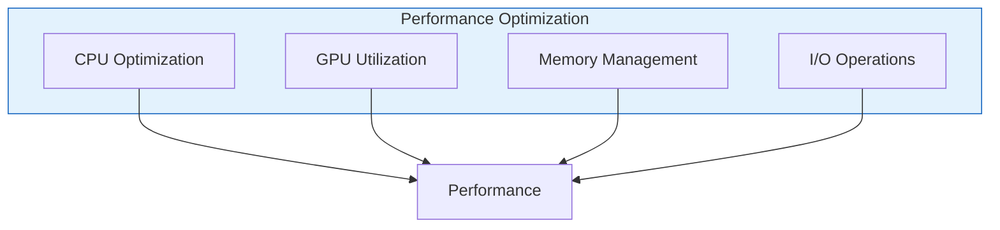
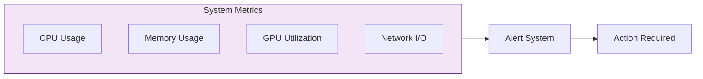

# Deployment Guide

## 📋 Prerequisites

### Requirements
- Linux server (Ubuntu 20.04+ recommended)
- 16GB RAM minimum for production
- 50GB SSD storage
- CUDA-capable GPU recommended
- Python 3.8 or higher
- Docker (optional)

## 🚀 Installation Steps

### Standard Installation
```bash
# Update system
sudo apt update && sudo apt upgrade -y

# Install Python dependencies
sudo apt install python3-pip python3-venv

# Clone repository
git clone https://github.com/UVU-AI-Innovate/UTTA.git
cd UTTA

# Create virtual environment
python3 -m venv venv
source venv/bin/activate

# Install requirements
pip install -r requirements.txt

# Download LLM model
ollama pull mistral

# Configure application
cp config.example.yaml config.yaml
nano config.yaml
```

### Docker Installation
```bash
# Build Docker image
docker build -t utta .

# Run container with terminal interface
docker run -d \
    --gpus all \
    -p 8000:8000 \
    -v /path/to/data:/app/data \
    --name utta-server \
    utta python src/interfaces/terminal_app.py

# Run container with web interface
docker run -d \
    --gpus all \
    -p 8000:8000 \
    -v /path/to/data:/app/data \
    --name utta-web \
    utta python src/interfaces/web_app.py
```

## ⚙️ Production Configuration

### Environment Variables
```bash
# .env
UTTA_ENV=production
UTTA_HOST=0.0.0.0
UTTA_PORT=8000
UTTA_WORKERS=4
UTTA_LOG_LEVEL=INFO
UTTA_MODEL_PATH=/path/to/models
UTTA_DATA_DIR=/path/to/data
UTTA_CACHE_DIR=/path/to/cache
```

### Nginx Configuration
```nginx
# /etc/nginx/sites-available/utta
server {
    listen 80;
    server_name your-domain.com;

    location / {
        proxy_pass http://localhost:8000;
        proxy_set_header Host $host;
        proxy_set_header X-Real-IP $remote_addr;
    }
}
```

## 📊 Monitoring and Maintenance

### System Monitoring
```bash
# Check application status
systemctl status utta

# View logs
journalctl -u utta

# Monitor resources
htop
nvidia-smi  # for GPU usage
```

### Important Considerations
- Regular backup of data directory
- Monitor GPU memory usage
- Set up log rotation
- Configure automatic updates
- Implement health checks

## 📈 Scaling Considerations

### Scaling Options

#### Vertical Scaling
- Upgrade RAM for larger models
- Add GPUs for parallel processing
- Increase storage for more data

#### Horizontal Scaling
- Load balancing across servers
- Distributed model serving
- Replicated data storage

### Performance Optimization



### Monitoring Dashboard



## 🔒 Security Considerations

### Security Measures
1. **Network Security**
   - Configure firewalls
   - Use SSL/TLS
   - Implement rate limiting

2. **Data Protection**
   - Encrypt sensitive data
   - Regular backups
   - Access control

3. **System Security**
   - Keep system updated
   - Monitor logs
   - Implement authentication

4. **API Security**
   - Use API keys
   - Input validation
   - Request throttling 