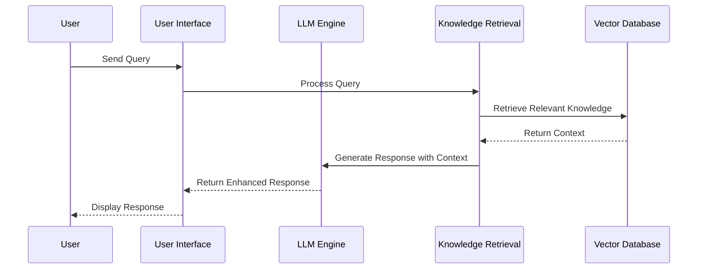
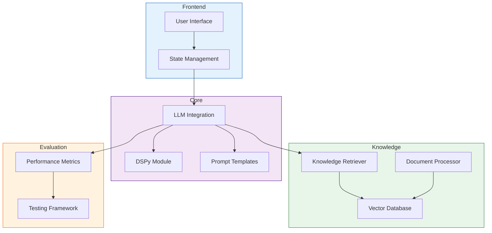
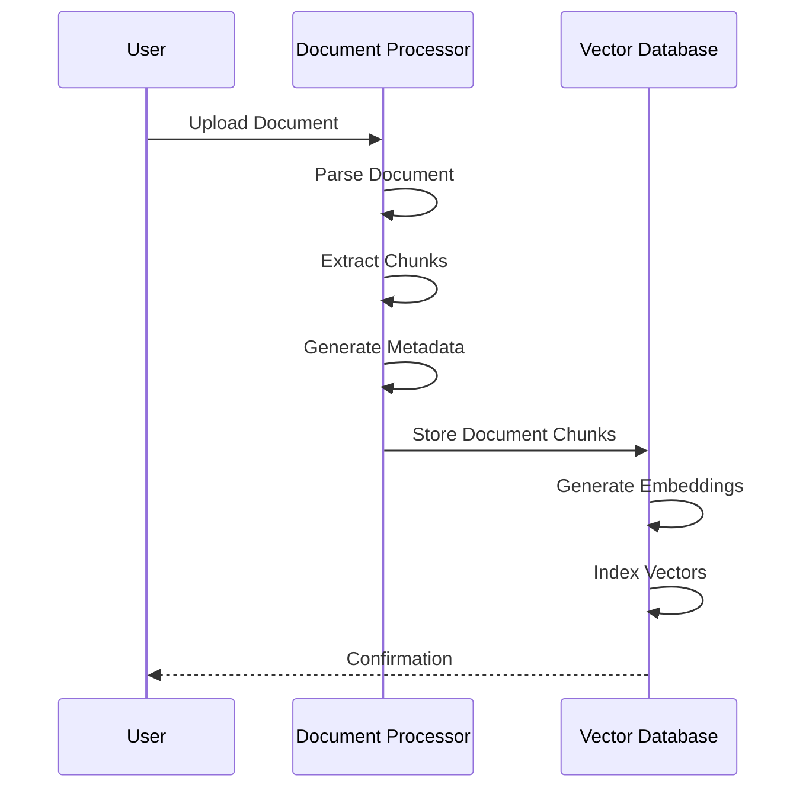
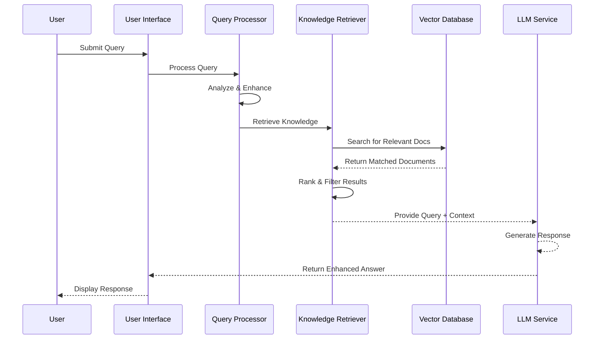

# LLM-Based Chatbot Development Framework Architecture

## Overview

This guide outlines the architecture of our LLM-Based Chatbot Development Framework, a comprehensive system for building domain-specific conversational agents with sophisticated knowledge retrieval capabilities. The framework is designed to be modular, extensible, and adaptable to various use cases, allowing developers to create powerful chatbots that leverage both general LLM capabilities and domain-specific knowledge.

The Utah Teacher Training Assistant (UTTA) is featured as a case study implementation of this framework, demonstrating how it can be applied to create educational applications.

## Core Architecture Components



### High-Level System Design



## Framework Components in Detail

### 1. Document Processing

The document processing pipeline is responsible for ingesting, parsing, and processing various document formats to extract relevant information for the knowledge base.

**Key Components:**
- **Document Parser**: Handles different file formats (PDF, EPUB, TXT, JSON)
- **Chunking System**: Breaks documents into manageable pieces
- **Metadata Extractor**: Extracts and preserves document metadata
- **Text Preprocessing**: Cleans and normalizes text content

```python
# Document Processing Example
from src.core.document_processor import DocumentProcessor

processor = DocumentProcessor()
chunks = processor.process_document("path/to/document.pdf", chunk_size=500)
```

### 2. Vector Knowledge Base

The vector knowledge base stores document chunks as vector embeddings, enabling semantic search and retrieval.

**Key Components:**
- **Embedding Generator**: Creates vector representations of text
- **Vector Store**: Stores and indexes embeddings
- **SQLite Integration**: Provides persistence and transaction support
- **Search Mechanism**: Implements semantic similarity search

```python
# Vector DB Example
from src.core.vector_database import VectorDatabase

db = VectorDatabase()
db.add_documents(chunks)
results = db.query("classroom management techniques", limit=5)
```

### 3. LLM Integration

The LLM integration layer provides a unified interface for interacting with various language model providers.

**Key Components:**
- **Provider Adapters**: Unified interfaces for different LLM providers
- **DSPy Integration**: Framework for self-improving prompts
- **Context Management**: Manages conversation history and context
- **Prompt Engineering**: Advanced prompt creation and optimization

```python
# LLM Integration Example
from src.llm.handlers import LLMHandler

llm = LLMHandler(provider="openai", model="gpt-4")
response = llm.generate_response(query, context_documents=retrieved_docs)
```

### 4. Knowledge Retrieval System

The knowledge retrieval system implements efficient search and retrieval mechanisms for finding relevant information.

**Key Components:**
- **Query Analyzer**: Processes and enhances user queries
- **Retrieval Mechanisms**: Multiple retrieval strategies
- **LlamaIndex Integration**: Advanced retrieval capabilities
- **Hybrid Search**: Combination of semantic and keyword search

```python
# Knowledge Retrieval Example
from src.retrieval.llama_index.integration import LlamaIndexRetriever

retriever = LlamaIndexRetriever(vector_db)
context = retriever.retrieve("How do I handle a disruptive student?")
```

## Workflow Sequences

### Document Ingestion Flow



### Query Resolution Flow



## Technical Stack

### Core Technologies
- **Python 3.10+**: Primary development language
- **FastAPI/Flask**: API and web service integration
- **SQLite/ChromaDB**: Vector and metadata storage
- **OpenAI/Anthropic APIs**: LLM providers
- **DSPy**: Declarative LLM programming framework
- **LlamaIndex**: Advanced retrieval system
- **Streamlit**: User interface development

### Development Tools
- **Poetry/Pip**: Dependency management
- **Pytest**: Testing framework
- **Docker**: Containerization
- **GitHub Actions**: CI/CD pipeline

## Security Considerations

- **API Key Management**: Secure handling of provider API keys
- **Input Validation**: Comprehensive validation of user inputs
- **Rate Limiting**: Prevention of excessive API usage
- **Content Filtering**: Monitoring and filtering of inappropriate content
- **Data Privacy**: Compliance with privacy regulations

## Performance Optimization

- **Caching Strategies**: Efficient caching of responses and embeddings
- **Batched Processing**: Optimized document processing
- **Asynchronous Operations**: Non-blocking API calls
- **Resource Management**: Efficient memory and computation usage
- **Monitoring & Logging**: Comprehensive system monitoring

## UTTA Case Study Implementation

The Utah Teacher Training Assistant (UTTA) implements this architecture for educational purposes:

- **Domain Knowledge**: Specialized knowledge base of teaching strategies
- **Scenario Generation**: Creation of realistic classroom scenarios
- **Response Evaluation**: Assessment of teaching approaches
- **Progressive Learning**: Adaptive difficulty based on user performance

This case study demonstrates how the framework can be adapted to specific domains while maintaining its modular structure. 