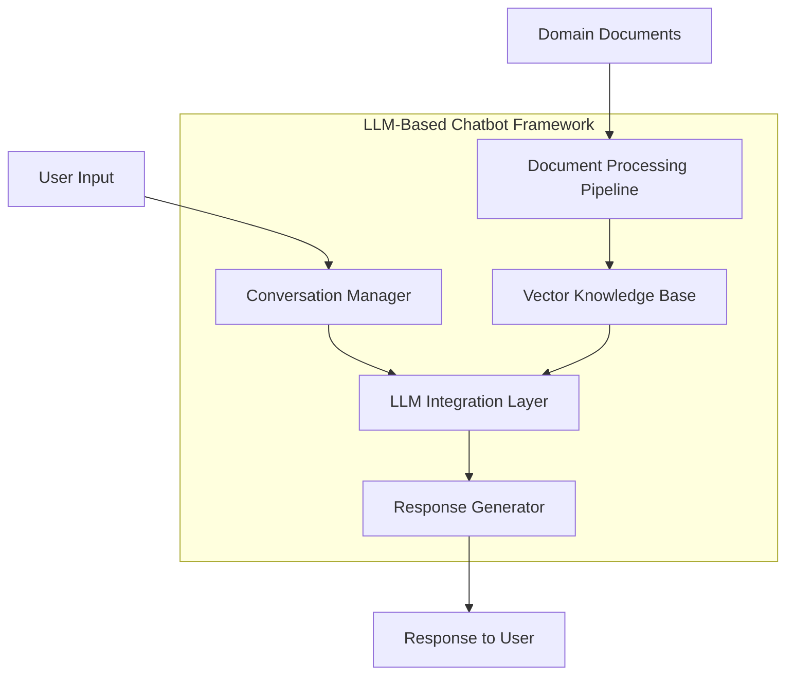
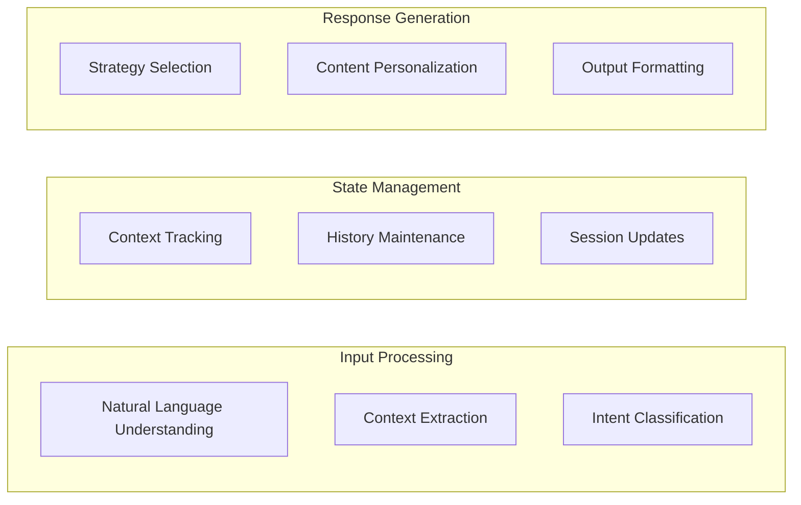

# Building LLM-Based Chatbots with Knowledge Retrieval

[]() 
[]()

## Learning Objectives

By the end of this guide, you'll be able to:
- Design sophisticated chatbot architectures with knowledge retrieval capabilities
- Implement conversation management systems for tracking context and user interactions
- Create personalization strategies that adapt to specific domain requirements
- Build comprehensive knowledge integration and retrieval mechanisms
- Deploy and evaluate LLM-based chatbots in real-world scenarios

## Framework Architecture for LLM-Based Chatbots

### Core Components

The framework architecture consists of these essential components:

1. **Document Processing Pipeline**: Processes various document formats to extract domain knowledge
2. **Vector Knowledge Base**: Stores and retrieves information using semantic search
3. **LLM Integration Layer**: Connects with various LLM providers (OpenAI, Anthropic, etc.)
4. **Conversation Manager**: Maintains context and manages the flow of interactions
5. **Response Generator**: Creates coherent and contextually relevant responses



### Case Study: UTTA

The Utah Teacher Training Assistant (UTTA) implements this architecture for educational purposes:



## Component Implementation Guide

### 1. Document Processing Pipeline

The document processing pipeline transforms raw documents into a format suitable for knowledge retrieval:

```python
from src.processing.document_processor import DocumentProcessor
from src.processing.text_chunker import TextChunker
from src.processing.text_embedder import TextEmbedder

# Initialize the pipeline components
document_processor = DocumentProcessor(
    supported_formats=["pdf", "docx", "txt", "md", "html"]
)

text_chunker = TextChunker(
    chunk_size=512,
    chunk_overlap=50
)

text_embedder = TextEmbedder(
    embedding_model="sentence-transformers/all-MiniLM-L6-v2",
    embedding_dimension=384
)

# Process documents
documents = document_processor.load_documents(
    directory_path="data/knowledge_base/",
    recursive=True
)

text_chunks = text_chunker.chunk_documents(documents)
embeddings = text_embedder.embed_chunks(text_chunks)

print(f"Processed {len(documents)} documents into {len(text_chunks)} chunks")
```

### 2. Vector Knowledge Base

The vector knowledge base stores and retrieves document embeddings:

```python
from src.retrieval.vector_store import VectorStore
from src.retrieval.query_engine import QueryEngine

# Initialize vector store
vector_store = VectorStore(
    embedding_dimension=384,
    store_type="faiss",  # Alternatives: "chroma", "qdrant", "pinecone"
    persistence_directory="data/vector_store/"
)

# Add document embeddings
vector_store.add_embeddings(
    embeddings=embeddings,
    documents=text_chunks,
    metadatas=[doc.metadata for doc in text_chunks]
)

# Create query engine
query_engine = QueryEngine(
    vector_store=vector_store,
    top_k=5,
    threshold=0.7
)

# Retrieve relevant documents
query = "What are effective strategies for classroom management?"
results = query_engine.retrieve(query)

print(f"Found {len(results)} relevant documents")
for i, result in enumerate(results):
    print(f"Result {i+1}: {result.document[:100]}... (Score: {result.score})")
```

### 3. LLM Integration Layer

The LLM integration layer provides a unified interface to various LLM providers:

```python
from src.llm.llm_factory import LLMFactory
from src.llm.handlers.openai_handler import OpenAIHandler
from src.llm.handlers.anthropic_handler import AnthropicHandler
from src.llm.handlers.local_llm_handler import LocalLLMHandler

# Initialize LLM factory
llm_factory = LLMFactory()

# Register different LLM handlers
llm_factory.register_handler("openai", OpenAIHandler)
llm_factory.register_handler("anthropic", AnthropicHandler)
llm_factory.register_handler("local", LocalLLMHandler)

# Get appropriate LLM handler based on configuration
config = {
    "provider": "openai",
    "model": "gpt-4",
    "temperature": 0.7,
    "max_tokens": 1000
}

llm = llm_factory.get_llm(config)

# Generate response
response = llm.generate(
    prompt="Explain the concept of retrieval-augmented generation",
    system_message="You are an educational assistant helping explain complex AI concepts."
)

print(f"LLM Response: {response}")
```

### 4. Conversation Manager

The conversation manager tracks context and user interactions:

```python
from src.conversation.manager import ConversationManager
from src.conversation.message import Message, Role
from datetime import datetime

# Initialize conversation manager
conversation_manager = ConversationManager(
    max_history_length=10,
    user_id="user-123",
    session_id="session-456"
)

# Add messages to conversation
conversation_manager.add_message(
    Message(
        role=Role.USER,
        content="How do I implement a retrieval system?",
        timestamp=datetime.now()
    )
)

conversation_manager.add_message(
    Message(
        role=Role.ASSISTANT,
        content="To implement a retrieval system, you need to follow these steps...",
        timestamp=datetime.now()
    )
)

# Get conversation history
history = conversation_manager.get_history()
formatted_history = conversation_manager.format_for_llm(
    include_system_message=True,
    system_message="You are a helpful assistant that specializes in AI and chatbot development."
)

# Update conversation state
conversation_manager.update_state({
    "last_topic": "retrieval systems",
    "user_expertise": "intermediate",
    "resources_shared": ["vector_db_guide.pdf"]
})

print(f"Conversation has {len(history)} messages")
print(f"Current state: {conversation_manager.get_state()}")
```

### 5. Response Generator

The response generator creates coherent and relevant responses:

```python
from src.response.generator import ResponseGenerator
from src.response.formatter import ResponseFormatter
from src.response.templates import load_template

# Initialize response generator
response_generator = ResponseGenerator(
    llm=llm,
    conversation_manager=conversation_manager,
    query_engine=query_engine
)

# Generate response with knowledge retrieval
query = "What are best practices for prompt engineering?"
retrieved_context = query_engine.retrieve(query)

response = response_generator.generate_response(
    query=query, 
    retrieved_context=retrieved_context,
    response_type="educational"
)

# Format response
formatter = ResponseFormatter()
template = load_template("educational_response")
formatted_response = formatter.format(
    response=response,
    template=template,
    variables={
        "user_name": "John",
        "expertise_level": "intermediate"
    }
)

print(f"Generated response: {formatted_response}")
```

## Practical Implementation Strategies

### 1. Knowledge Base Construction

Building a robust knowledge base is crucial for intelligent chatbots:

```python
from src.knowledge.knowledge_base_builder import KnowledgeBaseBuilder
from src.knowledge.sources.web_scraper import WebScraper
from src.knowledge.sources.document_loader import DocumentLoader
from src.knowledge.sources.api_connector import APIConnector

# Initialize knowledge base builder
kb_builder = KnowledgeBaseBuilder(
    output_directory="data/knowledge_base/",
    embedding_model="sentence-transformers/all-mpnet-base-v2"
)

# Add different knowledge sources
web_scraper = WebScraper(
    allowed_domains=["docs.python.org", "pytorch.org"],
    max_pages=100
)

document_loader = DocumentLoader(
    supported_formats=["pdf", "docx", "txt"]
)

api_connector = APIConnector(
    api_endpoints=[
        {"url": "https://api.example.com/data", "auth_type": "bearer", "token": "YOUR_TOKEN"}
    ]
)

# Add sources to knowledge base
kb_builder.add_source(web_scraper, source_id="web_documentation")
kb_builder.add_source(document_loader, source_id="local_documents")
kb_builder.add_source(api_connector, source_id="api_data")

# Build knowledge base
kb_builder.build(
    chunk_size=512,
    chunk_overlap=50,
    vector_store_type="chroma"
)

print(f"Knowledge base built with {kb_builder.document_count} documents")
```

### 2. Efficient RAG Implementation

Retrieval-Augmented Generation (RAG) improves response quality by providing relevant context:

```python
from src.rag.rag_engine import RAGEngine
from src.rag.query_transformers import QueryExpander
from src.rag.rerankers import CrossEncoderReranker

# Initialize RAG components
query_expander = QueryExpander(
    llm=llm,
    num_expansions=3
)

reranker = CrossEncoderReranker(
    model_name="cross-encoder/ms-marco-MiniLM-L-6-v2"
)

# Create RAG engine
rag_engine = RAGEngine(
    vector_store=vector_store,
    query_expander=query_expander,
    reranker=reranker,
    llm=llm
)

# Process query with RAG
query = "How can I improve my chatbot's response accuracy?"
response = rag_engine.process(
    query=query,
    max_tokens=1000,
    temperature=0.7
)

print(f"RAG Response: {response}")
print(f"Retrieved documents: {rag_engine.last_retrieved_documents}")
```

### 3. Conversation Flows and Intents

Managing conversation flows and intents improves user experience:

```python
from src.conversation.intent import IntentClassifier
from src.conversation.flows import ConversationFlow, FlowState
from src.conversation.actions import SystemAction

# Initialize intent classifier
intent_classifier = IntentClassifier(
    model_path="models/intent_classifier/",
    confidence_threshold=0.7
)

# Define conversation flows
help_flow = ConversationFlow(
    name="help_flow",
    initial_state="ask_topic",
    states={
        "ask_topic": FlowState(
            prompt="What topic do you need help with?",
            transitions={
                "topic_provided": "provide_resources",
                "unclear": "clarify_topic"
            }
        ),
        "provide_resources": FlowState(
            action=SystemAction.RETRIEVE_RESOURCES,
            transitions={
                "resources_found": "end_flow",
                "no_resources": "suggest_alternatives"
            }
        )
    }
)

# Process user message
user_message = "I need help with vector databases"
intent = intent_classifier.classify(user_message)

if intent == "help_request":
    flow = help_flow
    flow_state = flow.get_initial_state()
    response = flow_state.execute(user_message)
else:
    # Handle other intents
    pass

print(f"Detected intent: {intent}")
print(f"Flow response: {response}")
```

## Case Study: UTTA Implementation

The UTTA (Utah Teacher Training Assistant) showcases the framework in action:

```python
from src.applications.utta.scenario_generator import TeachingScenarioGenerator
from src.applications.utta.response_evaluator import TeacherResponseEvaluator
from src.applications.utta.feedback_generator import FeedbackGenerator

# Initialize UTTA components
scenario_generator = TeachingScenarioGenerator(
    llm=llm,
    difficulty_levels=["beginner", "intermediate", "advanced"],
    teaching_domains=["classroom_management", "differentiation", "assessment"]
)

response_evaluator = TeacherResponseEvaluator(
    llm=llm,
    evaluation_criteria=[
        "effectiveness", "student_centeredness", "alignment_with_principles"
    ],
    rubric_path="data/utta/evaluation_rubric.json"
)

feedback_generator = FeedbackGenerator(
    llm=llm,
    knowledge_base=query_engine,
    feedback_types=["constructive", "suggestive", "reflective"]
)

# Generate teaching scenario
scenario = scenario_generator.generate(
    difficulty="intermediate",
    domain="classroom_management",
    grade_level=5
)

# Simulate teacher response
teacher_response = "I would first address the disruptive student privately..."

# Evaluate response
evaluation = response_evaluator.evaluate(
    scenario=scenario,
    teacher_response=teacher_response
)

# Generate feedback
feedback = feedback_generator.generate(
    scenario=scenario,
    teacher_response=teacher_response,
    evaluation=evaluation
)

print(f"Scenario: {scenario[:100]}...")
print(f"Evaluation: {evaluation}")
print(f"Feedback: {feedback}")
```

## Performance Optimization and Scaling

### Caching and Performance

Implement caching to improve response times:

```python
from src.optimization.cache import ResponseCache
from src.optimization.token_counter import TokenCounter
from src.monitoring.performance_tracker import PerformanceTracker

# Initialize optimization components
response_cache = ResponseCache(
    cache_type="redis",
    ttl=3600,  # Cache expires after 1 hour
    max_size=10000  # Maximum entries in cache
)

token_counter = TokenCounter(
    encoding_name="cl100k_base"  # OpenAI's encoding
)

performance_tracker = PerformanceTracker(
    metrics=["latency", "token_usage", "cache_hit_rate"]
)

# Process query with caching
query = "What is vector search?"
cache_key = response_cache.generate_key(query)

# Start tracking performance
performance_tracker.start_tracking()

# Check cache
cached_response = response_cache.get(cache_key)
if cached_response:
    response = cached_response
    performance_tracker.record_cache_hit()
else:
    # Generate new response
    response = rag_engine.process(query)
    token_count = token_counter.count(query + response)
    
    # Cache the response
    response_cache.set(cache_key, response)
    performance_tracker.record_cache_miss(token_count)

# End tracking and get metrics
metrics = performance_tracker.end_tracking()

print(f"Response: {response[:100]}...")
print(f"Performance metrics: {metrics}")
```

### Horizontal Scaling

Scale the chatbot for high-traffic applications:

```python
from src.scaling.load_balancer import LoadBalancer
from src.scaling.worker_pool import WorkerPool
from src.scaling.rate_limiter import RateLimiter

# Initialize scaling components
worker_pool = WorkerPool(
    min_workers=5,
    max_workers=20,
    idle_timeout=300  # seconds
)

load_balancer = LoadBalancer(
    worker_pool=worker_pool,
    strategy="least_busy"  # Alternatives: "round_robin", "random"
)

rate_limiter = RateLimiter(
    requests_per_minute=100,
    burst_limit=20
)

# Process user request with scaling
user_request = {
    "user_id": "user-123",
    "query": "How do I create a conversational AI?",
    "session_id": "session-456"
}

# Check rate limit
if rate_limiter.allow_request(user_request["user_id"]):
    # Assign request to worker
    worker = load_balancer.get_worker()
    
    # Process request
    response = worker.process_request(user_request)
    
    # Release worker
    worker_pool.release_worker(worker)
else:
    response = {"error": "Rate limit exceeded. Please try again later."}

print(f"Worker utilization: {worker_pool.utilization}")
print(f"Response: {response}")
```

## Deployment Strategies

The framework supports various deployment options:

1. **Containerized Deployment**:
   - Docker for containerization
   - Kubernetes for orchestration
   - Helm charts for deployment management

2. **Serverless Deployment**:
   - AWS Lambda for stateless processing
   - API Gateway for request handling
   - S3 for static asset storage

3. **Hybrid Deployment**:
   - Stateful components in containers
   - Stateless components as serverless functions
   - Vector database as managed service

For detailed deployment instructions, see the [Deployment Guide](Deployment-Guide.md).

## Evaluation and Monitoring

### Evaluation Metrics

The framework provides tools for comprehensive evaluation:

```python
from src.evaluation.evaluator import ChatbotEvaluator
from src.evaluation.metrics import AccuracyMetric, LatencyMetric, RelevanceMetric

# Initialize evaluator
evaluator = ChatbotEvaluator()

# Add evaluation metrics
evaluator.add_metric(AccuracyMetric())
evaluator.add_metric(LatencyMetric())
evaluator.add_metric(RelevanceMetric(
    ground_truth_data="data/evaluation/ground_truth.json"
))

# Run evaluation
evaluation_results = evaluator.evaluate(
    chatbot=rag_engine,
    test_dataset="data/evaluation/test_queries.json",
    num_samples=100
)

print(f"Evaluation results: {evaluation_results}")
```

### Monitoring in Production

Implement comprehensive monitoring for production deployments:

```python
from src.monitoring.dashboard import MonitoringDashboard
from src.monitoring.alerting import AlertManager
from src.monitoring.loggers import QueryLogger, ErrorLogger

# Initialize monitoring components
dashboard = MonitoringDashboard(
    update_interval=60,  # seconds
    metrics=["requests_per_minute", "avg_latency", "error_rate"]
)

alert_manager = AlertManager(
    notification_channels=["email", "slack"],
    alert_thresholds={
        "error_rate": 0.05,  # 5% error rate
        "latency": 2000,     # 2000ms latency
        "downtime": 60       # 60 seconds downtime
    }
)

query_logger = QueryLogger(
    log_directory="logs/queries/",
    rotation="daily"
)

error_logger = ErrorLogger(
    log_directory="logs/errors/",
    error_levels=["warning", "error", "critical"]
)

# Log query and monitor system
def process_and_monitor_query(query, user_id):
    try:
        # Log incoming query
        query_logger.log(query, user_id)
        
        # Process query
        start_time = time.time()
        response = rag_engine.process(query)
        end_time = time.time()
        
        # Update metrics
        latency = (end_time - start_time) * 1000  # convert to ms
        dashboard.update_metric("avg_latency", latency)
        dashboard.increment_metric("requests_per_minute")
        
        return response
        
    except Exception as e:
        # Log error
        error_logger.log(str(e), user_id)
        
        # Update error metrics
        dashboard.increment_metric("error_count")
        
        # Check if alert needed
        if dashboard.get_metric("error_rate") > alert_manager.get_threshold("error_rate"):
            alert_manager.send_alert(
                "High error rate detected",
                f"Current error rate: {dashboard.get_metric('error_rate')}"
            )
        
        return {"error": "An error occurred. Please try again later."}
```

## Conclusion

This guide provides a comprehensive framework for building sophisticated LLM-based chatbots with knowledge retrieval capabilities. By implementing the components described here, you can create chatbots that are:

- **Intelligent**: Leveraging the latest LLM technology with domain-specific knowledge
- **Contextual**: Maintaining conversation state and history for natural interactions
- **Scalable**: Supporting high traffic and large knowledge bases
- **Measurable**: With comprehensive evaluation and monitoring capabilities

The UTTA project demonstrates how these components can be integrated to create a specialized educational assistant, but the framework is designed to be adaptable to various domains and use cases.

For further guidance, explore the related documentation:
- [Architecture Guide](Architecture-Guide.md)
- [Deployment Guide](Deployment-Guide.md)
- [LLM Integration Guide](LLM-Guide.md)
- [Knowledge Retrieval Guide](Knowledge-Retrieval-Guide.md) 