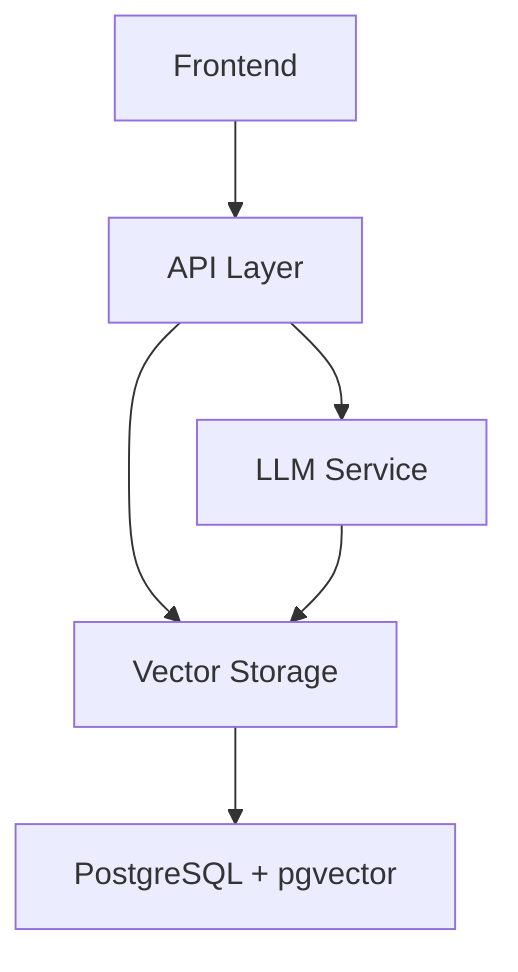

# Vector Storage Integration Guide

## System Architecture

### Component Integration


## Integration Points

### 1. API Layer Integration
```python
# api/vector_endpoints.py
from database.vector_ops import VectorOperations
from utils.embedding import EmbeddingGenerator

class VectorAPI:
    def __init__(self):
        self.vector_ops = VectorOperations()
        self.embedder = EmbeddingGenerator()

    async def search_similar_content(self, query: str):
        try:
            results = self.vector_ops.find_similar_scenarios(query)
            return {"status": "success", "results": results}
        except SearchError as e:
            return {"status": "error", "message": str(e)}
```

### 2. LLM Integration
```python
# ai/llm_service.py
from config.vector_config import SIMILARITY_THRESHOLD
from database.vector_ops import VectorOperations

class LLMService:
    def __init__(self):
        self.vector_ops = VectorOperations()
        self.model = load_llm_model()

    async def generate_response(self, query: str, context: str):
        # Find relevant content using vector search
        similar_content = self.vector_ops.find_similar_scenarios(
            query, 
            threshold=SIMILARITY_THRESHOLD
        )
        
        # Generate response using LLM with retrieved content
        response = self.model.generate(
            query=query,
            context=similar_content
        )
        return response
```

### 3. Content Management Integration
```python
# content/management.py
from database.vector_ops import VectorOperations

class ContentManager:
    def __init__(self):
        self.vector_ops = VectorOperations()

    async def add_teaching_scenario(self, scenario_data: dict):
        try:
            # Store scenario with vector embedding
            scenario_id = self.vector_ops.store_scenario(
                name=scenario_data["name"],
                description=scenario_data["description"],
                expected_response=scenario_data["expected_response"]
            )
            return {"status": "success", "scenario_id": scenario_id}
        except Exception as e:
            return {"status": "error", "message": str(e)}
```

## Data Flow

### 1. Query Processing Flow
```python
# Example of complete query flow
async def process_teacher_query(query: str):
    # 1. Generate embedding for query
    query_embedding = embedder.get_embedding(query)
    
    # 2. Find similar scenarios
    relevant_scenarios = vector_ops.find_similar_scenarios(query)
    
    # 3. Generate LLM response
    llm_response = await llm_service.generate_response(
        query=query,
        context=relevant_scenarios
    )
    
    # 4. Store interaction
    interaction_id = vector_ops.store_interaction(
        query=query,
        query_embedding=query_embedding,
        response=llm_response
    )
    
    return llm_response
```

### 2. Content Update Flow
```python
# Example of content update flow
async def update_teaching_content(content_batch: List[dict]):
    # 1. Process content in batches
    for batch in chunk_list(content_batch, BATCH_SIZE):
        # 2. Generate embeddings
        texts = [item["text"] for item in batch]
        embeddings = embedder.batch_get_embeddings(texts)
        
        # 3. Store content with embeddings
        await vector_ops.batch_store_content(
            content=batch,
            embeddings=embeddings
        )
```

## Performance Considerations

### 1. Caching Strategy
```python
# cache/vector_cache.py
from functools import lru_cache

class VectorCache:
    @lru_cache(maxsize=1000)
    def get_cached_embedding(self, text: str):
        return embedder.get_embedding(text)

    def invalidate_cache(self, text: str = None):
        if text:
            self.get_cached_embedding.cache_clear()
        else:
            self.get_cached_embedding.cache_info()
```

### 2. Batch Processing
```python
# utils/batch_processing.py
async def process_large_dataset(dataset: List[dict]):
    total_processed = 0
    for batch in chunk_list(dataset, BATCH_SIZE):
        try:
            await vector_ops.batch_process(batch)
            total_processed += len(batch)
            logger.info(f"Processed {total_processed}/{len(dataset)} items")
        except Exception as e:
            logger.error(f"Error processing batch: {str(e)}")
```

## Monitoring and Logging

### 1. Performance Monitoring
```python
# monitoring/vector_metrics.py
from prometheus_client import Counter, Histogram

EMBEDDING_TIME = Histogram(
    'embedding_generation_seconds',
    'Time spent generating embeddings'
)

SEARCH_TIME = Histogram(
    'vector_search_seconds',
    'Time spent on vector similarity search'
)

CACHE_HITS = Counter(
    'vector_cache_hits_total',
    'Number of vector cache hits'
)
```

### 2. Error Tracking
```python
# monitoring/error_tracking.py
def track_vector_operation(operation_name: str):
    def decorator(func):
        async def wrapper(*args, **kwargs):
            try:
                with EMBEDDING_TIME.time():
                    result = await func(*args, **kwargs)
                return result
            except Exception as e:
                logger.error(f"Vector operation failed: {str(e)}")
                raise
        return wrapper
    return decorator
```

## Testing Guidelines

### 1. Integration Tests
```python
# tests/integration/test_vector_storage.py
async def test_vector_search_integration():
    # Test complete flow from query to response
    query = "How to handle classroom disruption?"
    response = await process_teacher_query(query)
    
    assert response is not None
    assert len(response) > 0
    # Add more assertions

async def test_content_update_integration():
    # Test content update flow
    content = [{"text": "Example scenario"}]
    result = await update_teaching_content(content)
    
    assert result["status"] == "success"
    # Add more assertions
```

### 2. Performance Tests
```python
# tests/performance/test_vector_performance.py
async def test_vector_search_performance():
    # Test search performance
    start_time = time.time()
    results = await vector_ops.find_similar_scenarios("test query")
    duration = time.time() - start_time
    
    assert duration < 1.0  # Should respond within 1 second
    # Add more assertions
``` 