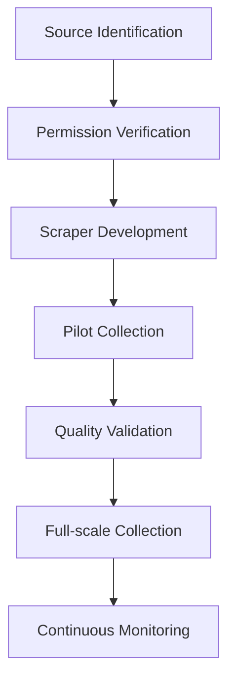

# Web Content Scraping Guide

## Overview
Comprehensive guide for ethically collecting educational content focused on elementary education (K-3) while complying with legal requirements and preserving system resources.


## Table of Contents
1. [Targeted Collection Strategy](#targeted-collection-strategy)
2. [Execution Plan](#execution-plan)
3. [Analysis Framework](#analysis-framework)
4. [Technical Implementation](#technical-implementation)
5. [Legal Compliance](#legal-compliance)
6. [Data Management](#data-management)
7. [Code Recipes](#code-recipes)
8. [Monitoring](#monitoring)
9. [Revision History](#revision-history)

---

## Targeted Collection Strategy

### Priority Sources
```markdown
- **Core Resources**
  - Utah Education Network (uen.org)
  - State-approved curriculum repositories
  - PBS LearningMedia (grades K-2 content)
  
- **Supplemental Sources**
  - Khan Academy Kids
  - Education.com worksheets
  - Teacher-created content portals
```

### Content Focus Matrix
| Content Type        | Target Criteria                  | Quality Indicators               |
|---------------------|----------------------------------|-----------------------------------|
| Lesson Plans         | Utah Standard 2.*               | Clear learning objectives        |
| Activities           | Hands-on, <30min duration        | Materials list included          |
| Assessments          | Rubric-based                     | Alignment with standards         |
| Multimedia           | <5min runtime                    | Closed captions available        |

---

## Execution Plan

### Phased Workflow


### Rate Limiting Protocol
```python
from time import sleep
from random import uniform

def ethical_request(url: str) -> requests.Response:
    """Make rate-limited request with jitter"""
    response = requests.get(url)
    sleep(uniform(2.5, 3.5))  # 2.5-3.5s delay between requests
    return response
```

---

## Analysis Framework

### Validation Pipeline
```python
def validate_content(content: dict) -> bool:
    """Check content against educational requirements"""
    checks = [
        has_required_metadata(content),
        is_age_appropriate(content['text']),
        matches_curriculum_standard(content),
        has_valid_license(content)
    ]
    return all(checks)
```

### Analysis Timing
| Stage         | Checks Performed                          | Tools Used              |
|---------------|-------------------------------------------|-------------------------|
| Scraping      | Basic filtering, format validation        | BeautifulSoup, PIL       |
| Post-Process  | Readability scores, standard alignment    | textstat, spaCy         |
| Monthly Audit | Content relevance, license expiration     | Custom reporting system |

---

## Technical Implementation

### Core Scraping Logic
```python
def safe_scrape(url: str, selectors: dict) -> dict:
    """Robust scraping with error handling"""
    try:
        response = ethical_request(url)
        soup = BeautifulSoup(response.text, 'html.parser')
        
        return {
            'title': extract_safe(soup, selectors['title']),
            'content': extract_safe(soup, selectors['content']),
            'metadata': {
                'source': url,
                'scraped_at': datetime.utcnow().isoformat(),
                'grade_level': detect_grade_level(soup)
            }
        }
    except Exception as e:
        log_error(f"Failed scraping {url}: {str(e)}")
        return None
```

### Age Validation
```python
from textstat import textstat

def is_grade_level(text: str, max_grade: int = 2) -> bool:
    """Check if text readability matches target grade"""
    try:
        level = textstat.text_standard(text, float_output=True)
        return level <= max_grade + 0.5
    except:
        return False
```

---

## Legal Compliance

### Compliance Checklist
- [ ] Verify robots.txt rules
- [ ] Respect `X-Robots-Tag` headers
- [ ] Maintain access logs for 90 days
- [ ] Implement content takedown process
- [ ] Annual legal review

### Header Policy
```python
EDU_HEADERS = {
    'User-Agent': 'UTAH-TTA-EduCollector/3.0 (+https://utta.edu/bot-info)',
    'Accept-Encoding': 'gzip, deflate',
    'From': 'edtech-scraping@utta.edu',
    'Referer': 'https://utta.edu'
}
```

---

## Data Management

### Storage Structure
```
/scraped_data/
├── raw/                # Original untouched content
├── processed/          # Cleaned and validated
├── metadata/           # JSON files with source info
└── rejected/           # Failed validation content
```

### Metadata Requirements
```json
{
    "source": "https://example.org/math-grade2",
    "collection_date": "2024-03-15",
    "content_type": "lesson_plan",
    "standard": "2.MD.1",
    "license": {
        "type": "CC BY-NC-SA 4.0",
        "verified": true
    }
}
```

---

## Code Recipes

### Curriculum Alignment
```python
UTAH_STANDARDS = ["2.G.1", "2.MD.1", "2.NBT.3"]  # Example standards

def align_standard(text: str) -> str:
    """Match content to Utah Core Standards"""
    for standard in UTAH_STANDARDS:
        if standard.lower() in text.lower():
            return standard
    return "Unclassified"
```

### Error Recovery
```python
from tenacity import retry, stop_after_attempt, wait_exponential

@retry(stop=stop_after_attempt(3), wait=wait_exponential(multiplier=1))
def reliable_download(url: str, path: str):
    """Retry failed downloads with exponential backoff"""
    response = requests.get(url, stream=True)
    save_content(response, path)
```

---

## Monitoring

### Key Metrics Dashboard
| Metric                | Target            | Alert Threshold |
|-----------------------|-------------------|-----------------|
| Success Rate          | 98%               | <95%            |
| Content Relevance     | 90%               | <85%            |
| License Compliance    | 100%              | <100%           |
| Avg Processing Time   | <2s               | >5s             |

### Audit Process
```markdown
1. Monthly content sampling (5% random)
2. Quarterly license verification
3. Annual legal review
4. Continuous link rot check
```

---

## Revision History
| Version | Date       | Changes                          |
|---------|------------|----------------------------------|
| 3.0     | 2024-03-15 | Added curriculum alignment tools |
| 2.2     | 2024-02-20 | Enhanced monitoring section      |
| 2.1     | 2024-01-15 | Added legal compliance framework |
| 1.0     | 2023-12-01 | Initial release                  |

---

## Additional Resources
- [Utah Core Standards](https://www.schools.utah.gov/curr/utahcore)
- [Educational Fair Use Guidelines](https://copyright.utah.edu)
- [Web Scraping Ethics Handbook](https://example.org/ethics) 