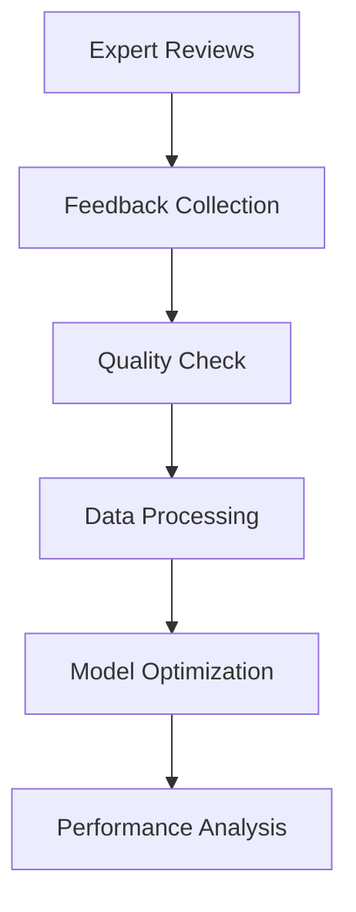

# Expert Tuning Documentation

## Overview

Expert Tuning is a specialized system that improves language models through expert feedback. It combines human teaching expertise with DSPy's optimization capabilities to enhance AI teaching responses.

## 📚 Documentation Sections

### Getting Started
- [Quick Start Guide](quickstart.md) - Get up and running in 5 minutes
- [Installation](installation.md) - Setup instructions
- [Core Concepts](concepts.md) - Key terminology and ideas

### Features
- [Feedback System](features/feedback.md) - Collecting and managing expert feedback
- [Model Optimization](features/optimization.md) - How feedback improves the model
- [Quality Control](features/quality.md) - Maintaining high standards

### Technical Guides
- [Architecture](technical/architecture.md) - System design
- [API Reference](technical/api.md) - API documentation
- [Configuration](technical/config.md) - System settings

### User Guides
- [Expert Guide](guides/expert.md) - For teaching experts
- [Integration](guides/integration.md) - System integration
- [Monitoring](guides/monitoring.md) - Performance tracking

## 🗺️ How It Works

## 🔑 Key Features

### Expert Feedback
- Teaching quality ratings
- Response improvements
- Example scenarios
- Quality validation

### Model Optimization
- Automated enhancement
- Context optimization
- Response improvement
- Continuous updates

### Quality Assurance
- Expert verification
- Content validation
- Automated checks
- Version control

### Analytics
- Impact tracking
- Performance metrics
- Quality trends
- Improvement tracking

## 📈 Quick Start

1. [Install the system](installation.md)
2. [Complete tutorial](quickstart.md)
3. [Review guidelines](guides/expert.md)
4. [Start contributing](guides/contributing.md)

## 🤝 Contributing

Help improve Expert Tuning:
- Share teaching expertise
- Improve documentation
- Report issues
- Suggest features

## 📚 Resources

- [DSPy Docs](https://dspy.ai/docs)
- [Community Forum](https://community.utta.ai)
- [Blog](https://blog.utta.ai)
- [Tutorials](https://tutorials.utta.ai)

## 📞 Support

- Docs: [docs.utta.ai](https://docs.utta.ai)
- Email: support@utta.ai
- Forum: [forum.utta.ai](https://forum.utta.ai)

## 📋 Updates

See [Changelog](CHANGELOG.md) for version history. 